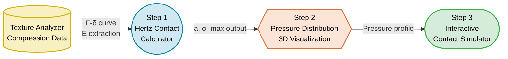

# 🔬 Week 9 Lab: Contact Stress & Hertz Theory
**– Hertz Contact Stress Calculator, 3D Pressure Distribution & Interactive Simulator –**

> 📂 **Navigation**: [← Week 7: Viscoelastic Properties](../week7/Week07_Lab_Viscoelastic_Properties.md) · [Main README](../../README.md) · [📝 Quiz Bank](../../QUIZ_BANK.md)

---

## 0. Lab Data: Apple (Fuji) Compression Test

This lab utilizes compression data from a texture analyzer (TA.XT Plus) with a spherical probe on apple specimens

| Force $F$ (N) | Penetration $\delta$ (mm) | Notes |
|:---:|:---:|:---|
| 0.5 | 0.12 | Initial compliance zone |
| 1.0 | 0.28 | Linear elastic zone |
| 2.0 | 0.58 | Linear elastic zone |
| 3.0 | 0.92 | Linear elastic zone |
| 5.0 | 1.65 | Near yield zone |
| 7.0 | 2.45 | Bio-yield vicinity |
| 10.0 | 3.80 | Post-yield plastic zone |
| 15.0 | 6.20 | Near rupture point |

<br>



---

## 1. Theoretical Background: Contact Mechanics & Hertz Theory

### 1-1. Stress and Strain Fundamentals


- **Stress**: $\sigma = F/A$ (unit: Pa) — internal resistance per unit area
- **Strain**: $\varepsilon = \Delta L / L_0$ (dimensionless) — deformation ratio
- **Young's Modulus**: $E = \sigma / \varepsilon$ — material stiffness indicator
- **Poisson's Ratio**: $\nu = -\varepsilon_{lateral} / \varepsilon_{axial}$ — lateral expansion ratio

### 1-2. Bio-yield Point


- **Definition**: Inflection point on stress-strain curve where slope first decreases
- **Physical meaning**: Onset of local cell wall buckling or micro-cracking
- **Design criterion**: Max contact stress < Bio-yield Stress × Safety factor (0.6~0.8)

### 1-3. Hertz Contact Theory


- **Background**: Established by Heinrich Hertz (1882) — elastic contact stress distribution
- **Key assumptions**
  1. Elastic deformation only (valid below plastic yield)
  2. Contact area ≪ radius of curvature
  3. Isotropic, homogeneous material
  4. Frictionless contact

- **Equivalent radius**: $\frac{1}{R^*} = \frac{1}{R_1} + \frac{1}{R_2}$
- **Combined elastic modulus**: $\frac{1}{E^*} = \frac{1-\nu_1^2}{E_1} + \frac{1-\nu_2^2}{E_2}$

### 1-4. Core Hertz Equations

| Parameter | Formula | Physical Meaning |
|:---:|:---:|:---|
| Contact radius $a$ | $(3FR^*/4E^*)^{1/3}$ | Radius of contact circle |
| Penetration $\delta$ | $a^2/R^*$ | Approach distance |
| Max stress $\sigma_{max}$ | $3F/(2\pi a^2)$ | Peak pressure at contact center |
| Pressure distribution $p(r)$ | $p_0\sqrt{1-(r/a)^2}$ | Semi-ellipsoidal profile |

### 1-5. Subsurface Stress and Bruise Formation


- Maximum shear stress: $\tau_{max} \approx 0.31 \cdot p_0$ (at depth $z \approx 0.48a$)
- Bruise mechanism: Max shear → Middle lamella separation → Vacuole rupture → Enzymatic browning
- **Key principle**: Bruises originate from **internal shear stress**, not surface impact

---

## 2. Python Lab: Hertz Contact Stress Analysis & Simulation

### 📝 [Required] Environment Setup
1. **Package installation**:
   ```bash
   pip install numpy matplotlib
   ```
2. **File location**: Run Python scripts in `en/week9/` directory
3. **Execution commands**: 
   ```bash
   python step1_hertz_calculator.py          # Hertz contact stress calculator
   python step2_pressure_distribution.py     # 3D pressure distribution
   python step3_hertz_contact_simulator.py   # Interactive contact simulator
   ```

---

### 📊 Python Script Details (Step 1 ~ Step 3)

#### 2-1. [Step 1] Hertz Contact Stress Calculator
- **Core algorithm**: Hertz contact theory encoded as functions for automatic stress computation
- **Input parameters**: Fruit radius, Young's modulus, Poisson's ratio, surface material
- **Key logic**:
  ```python
  def hertz_contact(F, R_star, E_star):
      a = (3 * F * R_star / (4 * E_star)) ** (1/3)
      delta = a**2 / R_star
      sigma_max = 3 * F / (2 * np.pi * a**2)
      return a, delta, sigma_max
  ```
- **Insight**: Compare $\sigma_{max}$ differences based on surface material (steel vs silicone)

#### 2-2. 🎨 [Step 2] 3D Pressure Distribution Visualization
- **Formula**: $p(r) = p_0 \sqrt{1 - (r/a)^2}$
- **Visualization**: matplotlib 3D Surface Plot for semi-ellipsoidal pressure profile
- **Observation points**
  - Contact center: Maximum stress concentration → bruise initiation point
  - Contact edge: Pressure converges to zero
  - As $a$ increases → peak pressure decreases (distributed over larger area)

#### 2-3. 🎛️ [Step 3] Interactive Contact Stress Simulator
- **UI controls**
  - Slider 1: Fruit radius $R$ (20~80 mm)
  - Slider 2: Fruit Young's modulus $E$ (0.5~20 MPa)
  - Slider 3: Poisson's ratio $\nu$ (0.2~0.49)
  - Radio buttons: Steel / Rubber / Silicone / Air cushion
- **Observation points**
  - Switching from steel → silicone: dramatic $\sigma_{max}$ reduction
  - Decreasing $R$ → smaller contact area → stress concentration
  - Decreasing $E$ → softer fruit → more deformation, less stress

#### 2-4. 🚀 [Advanced] Surface Material Comparison Challenge
- **Goal**: Compare $\sigma_{max}$ across 4 surface materials
- **Tasks**:
  1. Modify `E_surface` in Step 1 and run 4 iterations
  2. Create comparison table for $a$, $\delta$, $\sigma_{max}$
  3. Calculate safety factor against Bio-yield (~300 kPa)

#### 2-5. 🚀 [Advanced] Drop Impact Equivalent Load Analysis
- **Goal**: Calculate equivalent static loads for various drop heights (5~30 cm)
- **Tasks**:
  1. Compute impact velocity: $v = \sqrt{2gh}$
  2. Calculate equivalent force: $F_{eq} \propto (m \cdot v^2)^{3/5}$
  3. Determine max allowable drop height via Hertz analysis

---

## 3. 💡 Discussion Topics

### Discussion 1: Temperature Effects on Mechanical Properties
- **Context**: Apple $E$ and Bio-yield changes at refrigeration ($4^\circ C$) vs room temperature ($25^\circ C$)
- **Topic**: Cold storage increases hardness → brittle fracture tendency vs room temperature softening → ductile fracture. Can the same sorting system work for both conditions?

### Discussion 2: Limitations of Hertz Theory for Biological Materials
- **Context**: Hertz assumes isotropic, homogeneous, elastic — real fruits are anisotropic, heterogeneous, viscoelastic
- **Topic**: Estimation of error ranges from assumption violations. Compare practical merits and limitations of Hertz analysis vs FEM simulation

### Discussion 3: Optimal Gripping Force for Robotic Harvesters
- **Context**: End-effector gripping force — prevent slipping vs prevent damage (dual boundary)
- **Topic**: Hertz-based vs experimental approaches for determining optimal gripping force ranges for different fruit types (apple, tomato, strawberry)

### Discussion 4: Cushioning Material Design Optimization
- **Context**: Inserting soft spacers between fruits reduces $E^*$ → stress distribution
- **Topic**: Cost-effectiveness comparison of expanded polystyrene, air-cell sheets, and fruit trays from contact mechanics perspective

### Discussion 5: Ripening Effects on Contact Stress
- **Context**: Pectin hydrolysis → cell wall weakening → $E$ decrease, Bio-yield reduction
- **Topic**: Damage risk when processing mixed maturity levels on same sorting line. Feasibility of adaptive sorting systems with real-time maturity sensing

---

## 4. 📝 Quiz Questions

### Q1. [Theory] Young's Modulus Definition
Which correctly defines Young's modulus ($E$)?
- [ ] A. Force divided by area ($F/A$)
- [ ] B. Deformation divided by original length ($\Delta L / L_0$)
- [x] C. Stress divided by strain ($\sigma / \varepsilon$) — material stiffness indicator
- [ ] D. Maximum stress minus yield stress

### Q2. [Theory] Bio-yield Point Identification
The most accurate description of Bio-yield Point is:
- [ ] A. The maximum stress point on the stress-strain curve
- [x] B. The inflection point where slope first decreases — onset of cell structure failure
- [ ] C. The limit where 100% shape recovery occurs after force removal
- [ ] D. The point where material completely fractures into two pieces

### Q3. [Theory] Hertz Contact Radius Formula
The correct Hertz formula for contact radius $a$ is:
- [x] A. $a = (3FR^*/4E^*)^{1/3}$
- [ ] B. $a = 3F/(2\pi E^*)$
- [ ] C. $a = \sqrt{F \cdot R^* / E^*}$
- [ ] D. $a = F / (\pi R^* E^*)$

### Q4. [Theory] Surface Material and Stress
When changing sorter roller material from stainless steel to soft silicone:
- [ ] A. Contact area decreases, maximum stress increases
- [x] B. Contact area increases, maximum stress decreases — stress distribution effect
- [ ] C. No change in either contact area or stress
- [ ] D. Both contact area and stress increase

### Q5. [Theory] Bruise Initiation Location
According to Hertz theory, where does fruit bruising first initiate?
- [ ] A. Center of contact surface
- [ ] B. Edge of contact circle
- [x] C. Below contact surface at depth $z \approx 0.48a$ — maximum shear stress location
- [ ] D. Fruit core center

### Q6. [Python] Hertz Contact Calculation
Which Python code correctly implements $a = (3FR^*/4E^*)^{1/3}$?
- [ ] A. `a = (3*F*R_star / (4*E_star)) ** (1/2)`
- [x] B. `a = (3*F*R_star / (4*E_star)) ** (1/3)`
- [ ] C. `a = 3*F*R_star / (4*E_star**(1/3))`
- [ ] D. `a = np.sqrt(3*F*R_star / (4*E_star))`

### Q7. [Python] 3D Visualization Module
Which matplotlib module was used for 3D Surface Plot in Step 2?
- [ ] A. `matplotlib.widgets.Slider`
- [x] B. `mpl_toolkits.mplot3d.Axes3D`
- [ ] C. `matplotlib.animation.FuncAnimation`
- [ ] D. `matplotlib.patches.Circle`

### Q8. [Theory] Sphere-Plane Equivalent Radius
When a spherical fruit (radius $R$) sits on a flat plate, the equivalent radius $R^*$ is:
- [ ] A. $R^* = R/2$
- [x] B. $R^* = R$ (since flat plate $R_2 = \infty$)
- [ ] C. $R^* = 2R$
- [ ] D. $R^* = \infty$

---

## 5. Lab Submission Requirements

- **Required submissions**
  - Screenshot of `step1_hertz_calculator.py` console output (contact radius + max stress)
  - Screenshot of `step2_pressure_distribution.py` 3D pressure plot
- **Advanced submissions (bonus)**
  - [Advanced] Surface material comparison table with safety factors
  - [Advanced] Drop height equivalent load analysis table
- Push verified code to GitHub `week9` branch
- For detailed GitHub setup and submission guide, refer to the [Lab Submission Guide](../../README.md)
