# 생물자원가공공학 1~7주차 심화 토론 종합 보고서
**작성자**: 신용섭

*※ 1주차는 오리엔테이션 및 실습 기초 셋업 단계로 고유의 심화 토론 주제가 없으므로 2주차부터 기술합니다.*

---

## 2주차: 원형도 및 구형도

### 1. 디지털 이미지의 계단 현상(Aliasing)이 형상 분석에 미치는 영향
* **개념 및 문제점**: 컴퓨터 픽셀은 사각형 모양 격자로 이루어져 있습니다. 완벽한 원형인 방울토마토의 테두리를 사진으로 찍으면 사각 격자를 따라 지그재그(계단) 모양이 발생합니다. 컴퓨터가 이 계단 톱니바퀴 선을 따라 둘레를 훑으면 실제 곡선 둘레보다 20~30% 길게 측정되는 치명적인 오류가 생깁니다.
* **현장 예시와 해결책**: 이를 방지하기 위해 픽셀의 경계면 픽셀 색상 농도를 비율별로 미적분하여 하나의 픽셀 안에서도 어느 지점까지가 진짜 테두리 선인지 예측하는 **'서브픽셀 알고리즘(Sub-pixel Edge Detection)'**을 사용합니다.

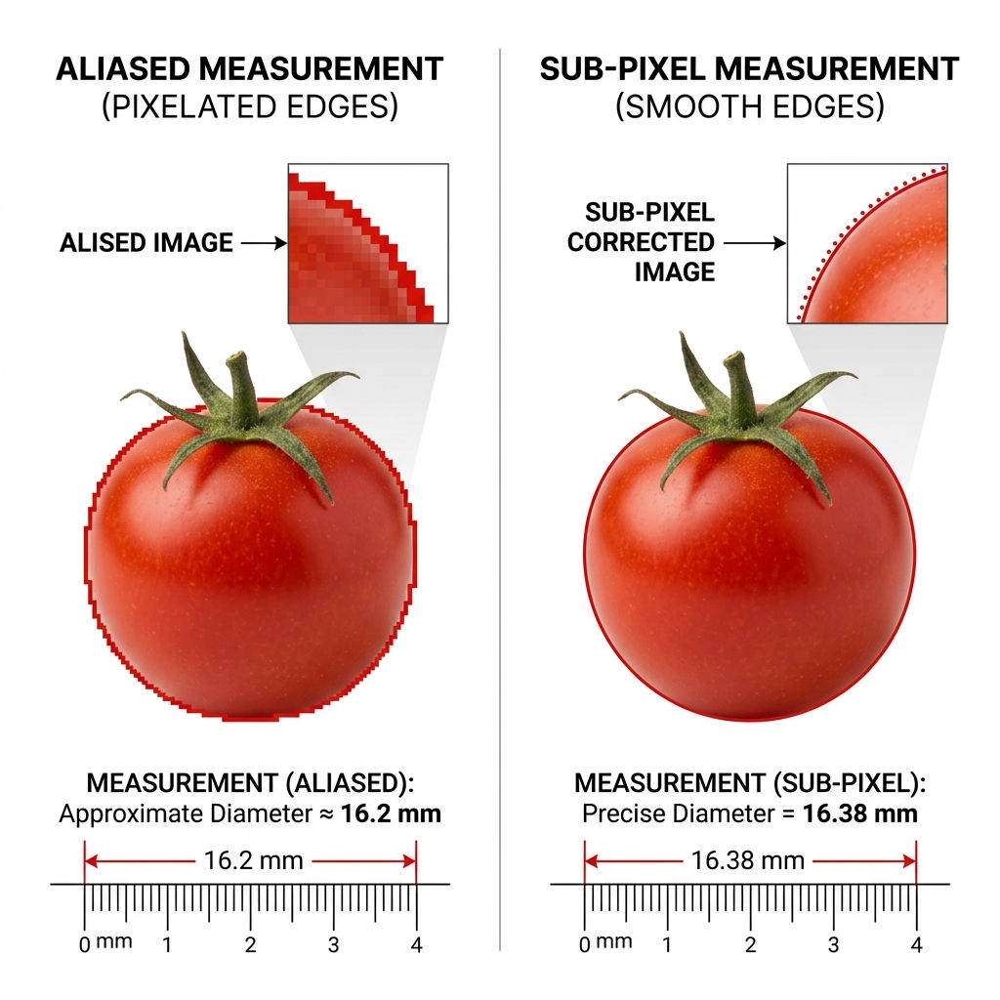

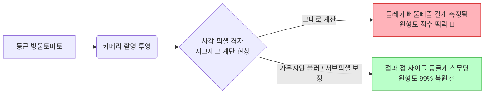
```mermaid
flowchart LR
    A[둥근 방울토마토] --> B(카메라 촬영 투영)
    B --> C{사각 픽셀 격자<br>지그재그 계단 현상}
    C -->|그대로 계산| D[둘레가 삐뚤빼뚤 길게 측정됨<br>원형도 점수 떡락 🚨]
    C -->|가우시안 블러 / 서브픽셀 보정| E[점과 점 사이를 둥글게 스무딩<br>원형도 99% 복원 ✅]
    
    style D fill:#ffb3ba,stroke:#d93838
    style E fill:#baffc9,stroke:#3bb143
```

### 2. 원형도와 구형도의 산업적 활용 — 농산물 선별 자동화
* **문제가 되는 상황**: 천장 카메라 한 대만으로 내려다본 2D 정면 사진(길이와 넓이)만으로는 이 과일이 럭비공처럼 뒤로 길쭉한지 납작한 바둑알인지 구분할 수 없습니다. 
* **해결책**: 측면 두께($T$)를 재기 위해 옆에서 찍는 카메라를 추가하거나, 수만 개의 고유 곡률 데이터를 AI로 학습시켜 그림자 패턴만으로 3D 구형도를 예측해 냅니다.

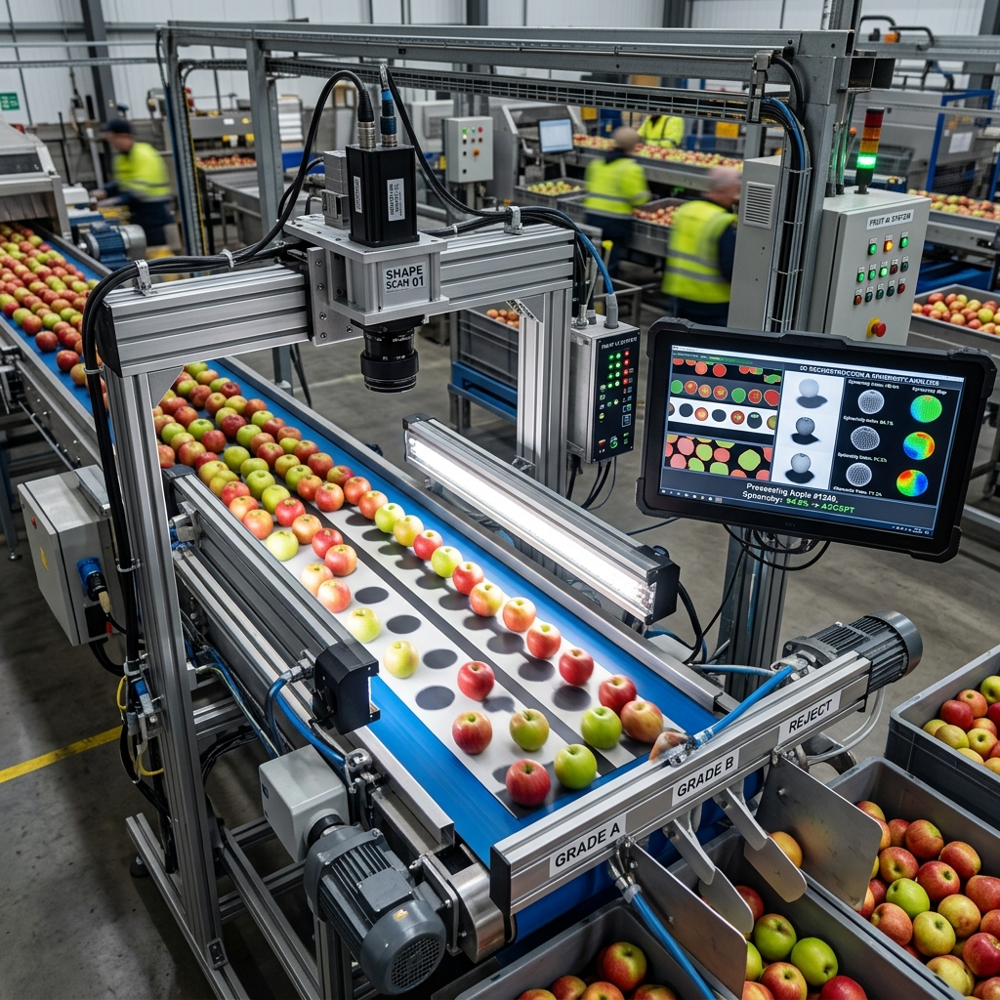

### 3. 이진화(Thresholding) 기법 선택이 형상 지표에 미치는 영향
* **문제가 되는 상황**: 밝은 레몬이 하얀색 벨트 위를 지나갈 때 조명이 어두우면, 일반 이진화(Otsu)는 레몬의 까만 그림자까지 객체로 착각해 레몬을 뚱뚱하게 자릅니다.
* **해결책**: **HSV 컬러 맵**으로 변환을 하면 단지 명암(흑백) 색상이 아니라 "노란색" 자체만 콕 집으므로 그림자나 거울빛 반사광을 완벽히 무시할 수 있습니다.

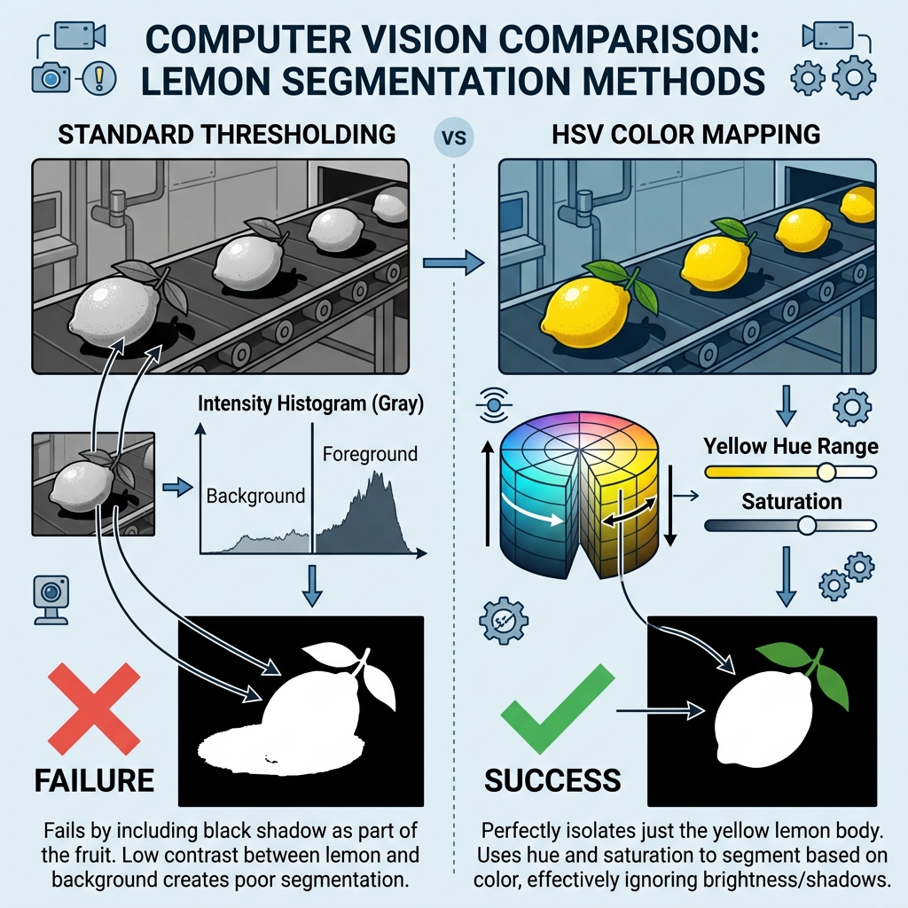

---

## 3주차: 체적 및 표면적 수치 적분

### 1. 기하학적 단순화의 한계와 비전 계측 보완점
* **문제가 되는 상황**: 2D 사진 윤곽만 보고 다트판 돌리듯 회전시켜 부피를 가늠하면, 울퉁불퉁한 생강이나 한쪽이 움푹 파인 기형 사과는 엉뚱한 부피로 부풀려집니다.
* **해결책**: 실제 연구에서는 3D LiDAR 레이저 스캐너를 사용하여 껍질 표면 전체를 3D 블록(Voxel, 3D 픽셀)으로 세밀하게 깎아 부피를 구합니다.

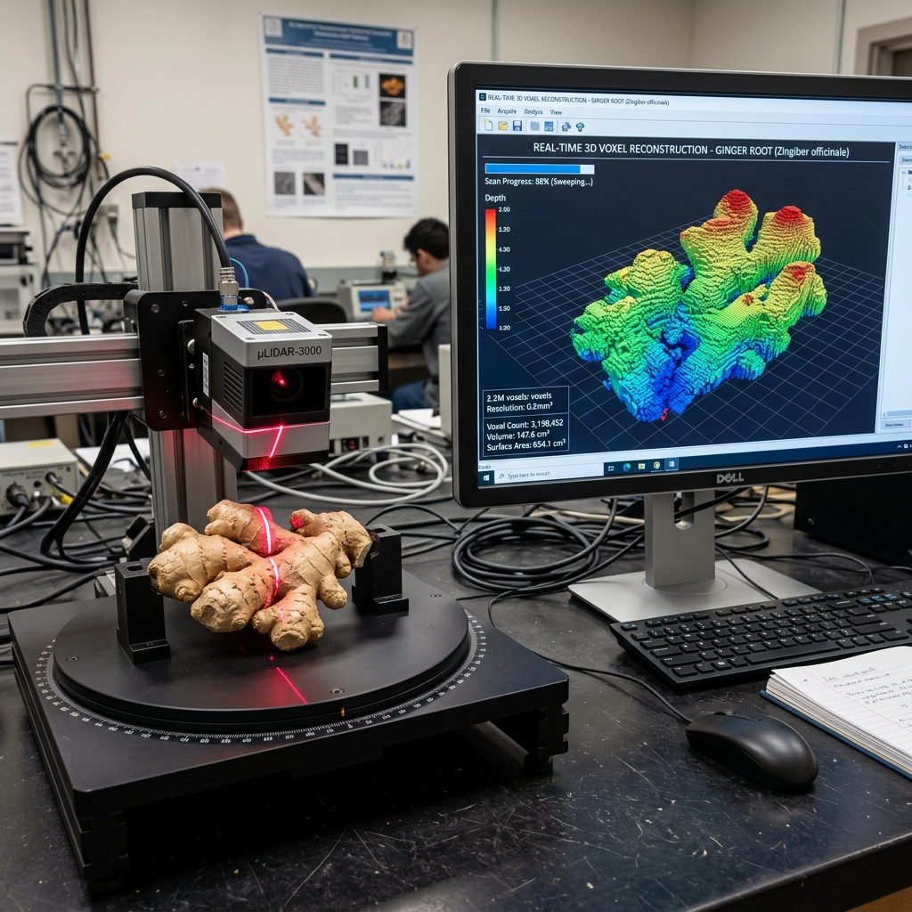

### 2. 비표면적이 가공 공정에 미치는 영향
* **문제가 되는 상황**: 호두 같은 대립종 보다, 참깨나 쌀 같은 소립종은 입자 하나하나는 작아도 사일로에 쌓였을 때 공기와 닿는 전체 껍질 표면적 합계(비표면적)가 무시무시하게 거대합니다. 조금만 더워도 호흡열이 삽시간에 주변으로 전파·발화됩니다.
* **해결책**: 강력한 **고압 블로워 냉각 송풍기**를 24시간 풀가동해야 내부 찜통 폭발 화재를 막습니다.

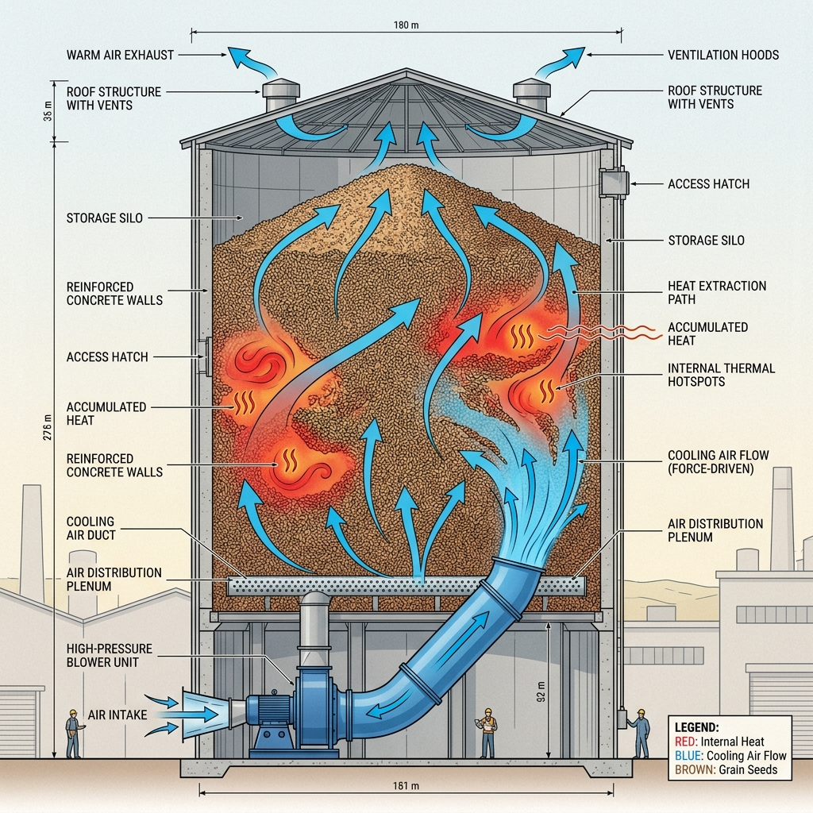

### 3. 수분 흡수성 자원의 체적 측정법 (공기 피크노미터)
* **문제가 되는 상황**: 무를 잴 때 물에 담그면 부피 측정이 되지만, 표고버섯이나 스펀지는 물을 흡수해 비커 측정 불가입니다. 따라서 빈 통에 질소 가스를 불어 넣어 압력 변화로 부피를 잽니다(공기 피크노미터).
* **해결책**: 자전거 펌프 쏠 때 뜨거워지듯 단열 압축 시 시스템 온도가 요동칩니다. 온도 불안정 상태에서 부피를 재면 오차가 크므로 반드시 3~5분 대기 후 온도가 식었을 때 측정해야 완벽합니다.

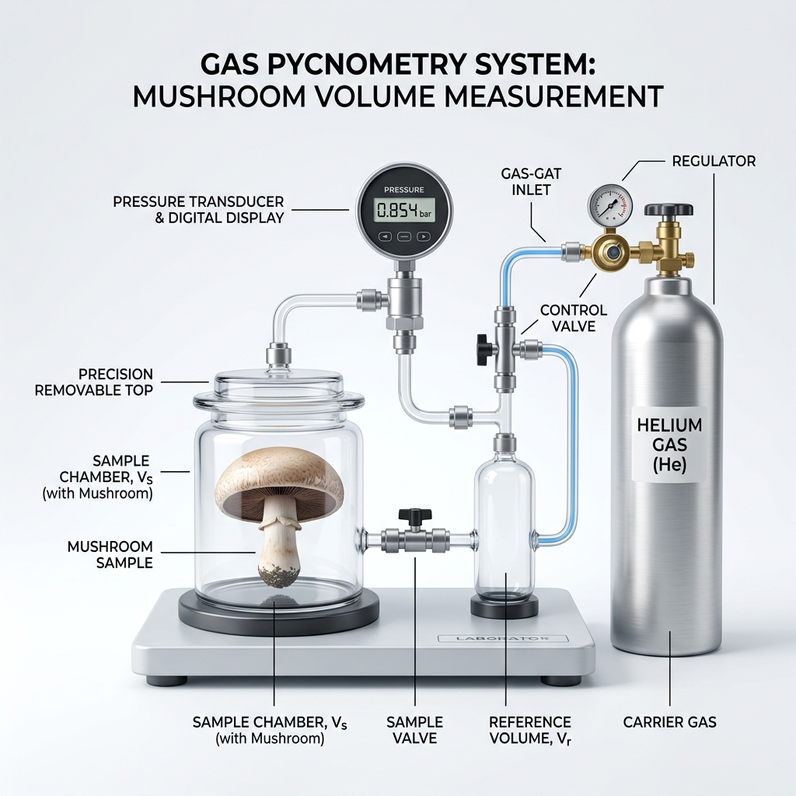

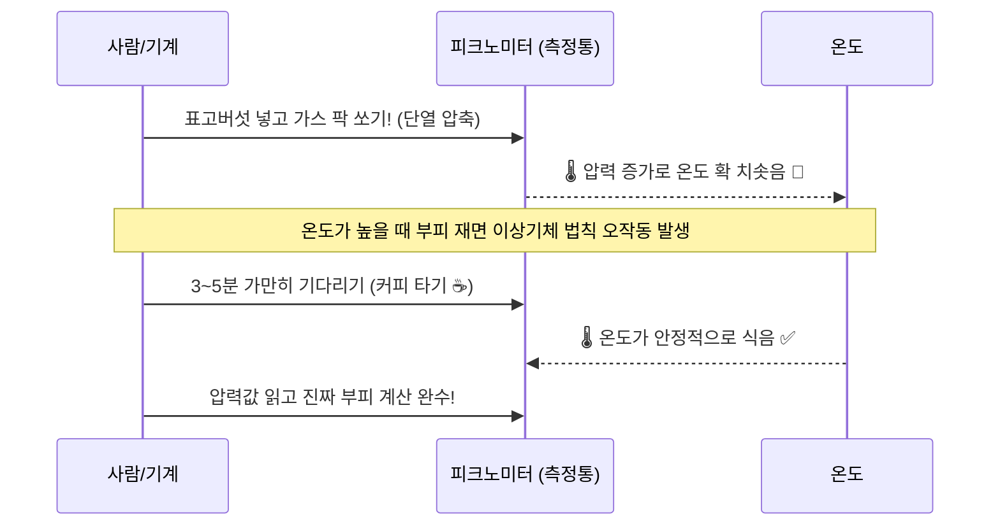
```mermaid
sequenceDiagram
    participant M as 사람/기계
    participant P as 피크노미터 (측정통)
    participant T as 온도
    M->>P: 표고버섯 넣고 가스 팍 쏘기! (단열 압축)
    P-->>T: 🌡️ 압력 증가로 온도 확 치솟음 🚨
    Note over M,T: 온도가 높을 때 부피 재면 이상기체 법칙 오작동 발생
    M->>P: 3~5분 가만히 기다리기 (커피 타기 ☕)
    T-->>P: 🌡️ 온도가 안정적으로 식음 ✅
    M->>P: 압력값 읽고 진짜 부피 계산 완수!
```

---

## 4주차: 밀도 및 공극률 측정과 시각화

### 1. 파티클 반경과 공극 구조의 상관관계
* **문제가 되는 상황**: 골프공 박스와 아주 고운 좁쌀 모래 박스의 비어있는 공간 총합(공극률)은 수학적으로 같습니다. 하지만 좁쌀의 틈새는 미로처럼 아주 비좁습니다.
* **해결책**: 건조기 팬을 아무리 세게 틀어도 좁쌀 틈의 마찰력 때문에 바람이 튕겨 나옵니다. 이 경우 스크류 교반기로 더미 자체를 마구 뒤섞어 터널을 파주어야 합니다.

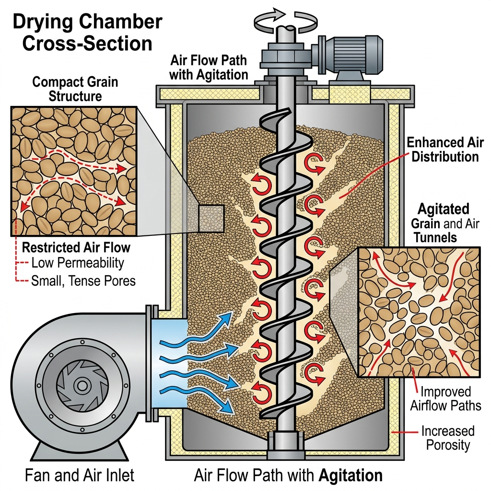

### 2. 진밀도 측정 시 수분 침투의 영향
* **문제가 되는 상황**: 땅콩 껍질을 물에 넣어 밀도를 잴 때, 공백 기공 구멍 사이로 물이 흡수되면 마치 '부피가 매우 작다'고 기계가 기만당하여 밀도가 강철처럼 무겁게 뻥튀기됩니다.
* **해결책**: 땅콩에 젖지 않는 파라핀 초코 왁스를 얇게 코팅하거나, 물 대신 틈으로 절대 넘어가지 않는 유기 용매액/초미세 유리 모래알을 채워 올바른 부피를 측정합니다.

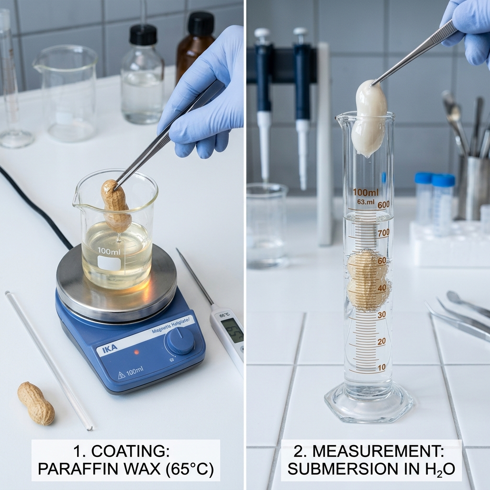

### 3. 3D 가상 패킹 시뮬레이션 계산 최적화
* **문제가 되는 상황**: 체리 1만 개가 상자에 무작위로 떨어져 쌓일 때 모든 체리끼리 겹치는지 체크하면 ($10,000 \times 10,000$ 패턴 계산) 배터리가 폭발하고 밤을 샙니다 (Brute force 연산 지옥).
* **해결책**: 상자에 바둑판 타일을 깔고 거주지를 배정하여, **"나는 좌상단 3번 칸 체리니까, 그쪽 동네 체리들하고만 거리를 잴게 (Spatial Hashing 결합)"** 방식을 쓰면 계산이 1초 만에 박살이 납니다.

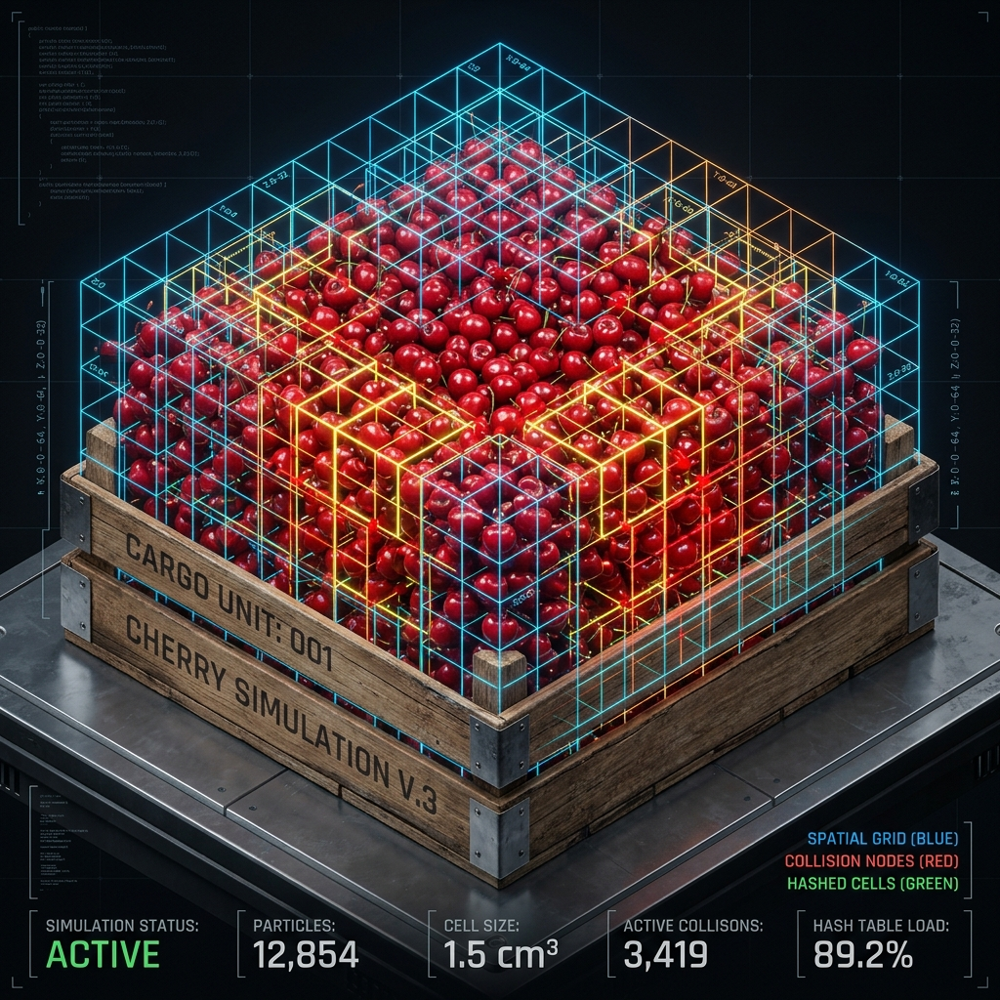

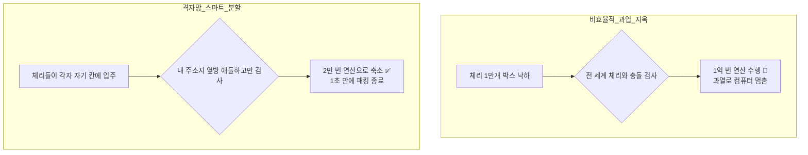
```mermaid
flowchart TD
    subgraph 비효율적_과업_지옥
    A[체리 1만개 박스 낙하] --> B{전 세계 체리와 충돌 검사}
    B --> C[1억 번 연산 수행 🚨<br>과열로 컴퓨터 멈춤]
    end
    
    subgraph 격자망_스마트_분할
    D[체리들이 각자 자기 칸에 입주] --> E{내 주소지 옆방 애들하고만 검사}
    E --> F[2만 번 연산으로 축소 ✅<br>1초 만에 패킹 종료]
    end
```

### 4. 수분 감소율에 따른 벌크 밀도/공극률 변화
* **문제가 되는 상황**: 창고에서 6개월 버려진 사과들. 물기가 증발해 무게는 20% 줄었어도, 딱딱한 피부 골격은 그대로 버텨 크기는 5%밖에 안 쪼그라들었습니다. 결과적으로 겉모습은 유지되는데 속이 텅텅 빈 풍선들이 박스 가득한 양상이 됩니다. 1입방미터당 채울 수 있는 산물 밀도가 하락해 트럭 가득 실어도 실질 중량이 미달하는 현상이 관측됩니다.

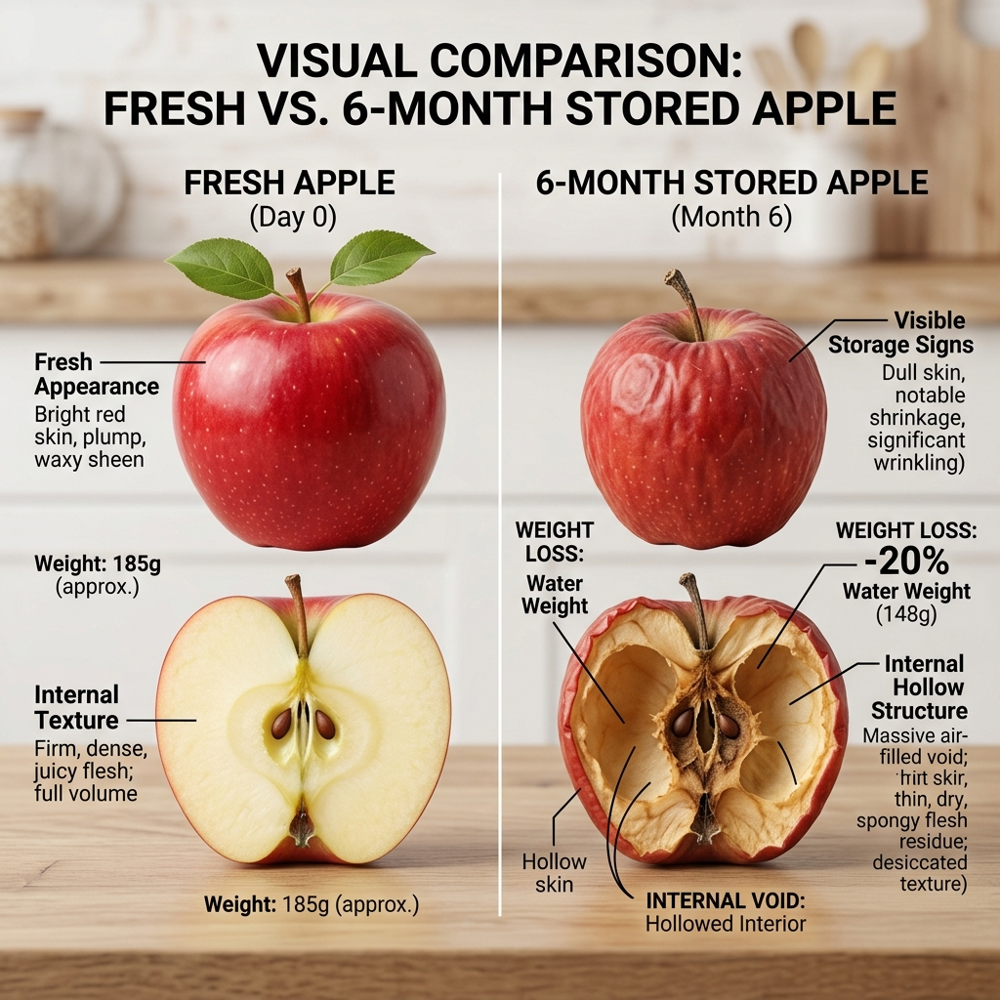

---

## 5주차: 유변학적 특성 (뉴턴 유체)

### 1. 점도와 경제성 트레이드오프 심화
* **문제가 되는 상황**: 사과즙을 보낼 때 가스 보일러로 80도까지 팔팔 끓이면 사과즙이 맹물처럼 묽어집니다. 펌프 전기 요금은 싸지지만 가스비 폭풍 및 사과의 비타민을 짓밟고 시커멓게 갈변시키는 참사가 일어납니다.
* **해결책**: 전기 요금 + 가스비 + "영양 파괴 가격(패널티)"의 3단계 그래프를 합산하여, 그래프 3개가 만나는 42도 정도의 미지근한 최적 조합 온도를 산출해 내야 합니다.

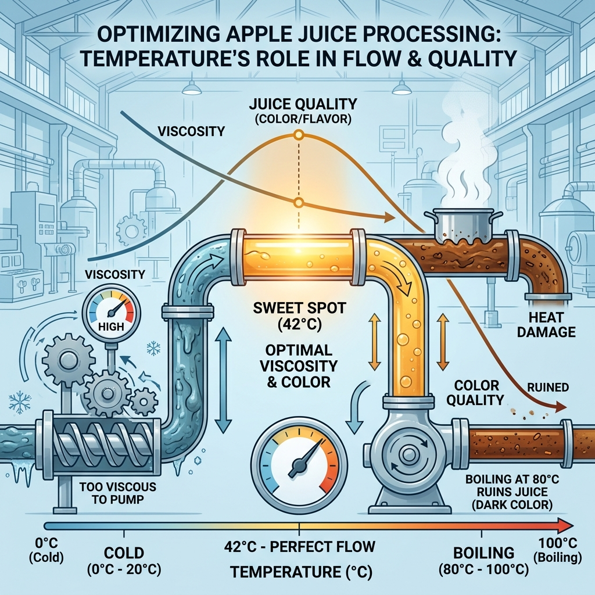

### 2. 직경 최적화 및 중간 부스터 펌프 설치
* **문제가 되는 상황**: 마찰 저항을 없애려고 파이프 두께를 20cm 대형 송수관으로 늘리면 마찰은 제로지만, 엄청난 무산소 스뎅 용접 인건비 파이프 값으로 사장님 지갑이 붕괴합니다.
* **해결책**: 파이프 두께는 10cm로 타협하고, 압력이 달리는 중간(예: 250m 지점) 파이프 구간에 소형 인라인 부스터 펌프를 재부착 추진해 보내는 것이 훨씬 현명합니다.

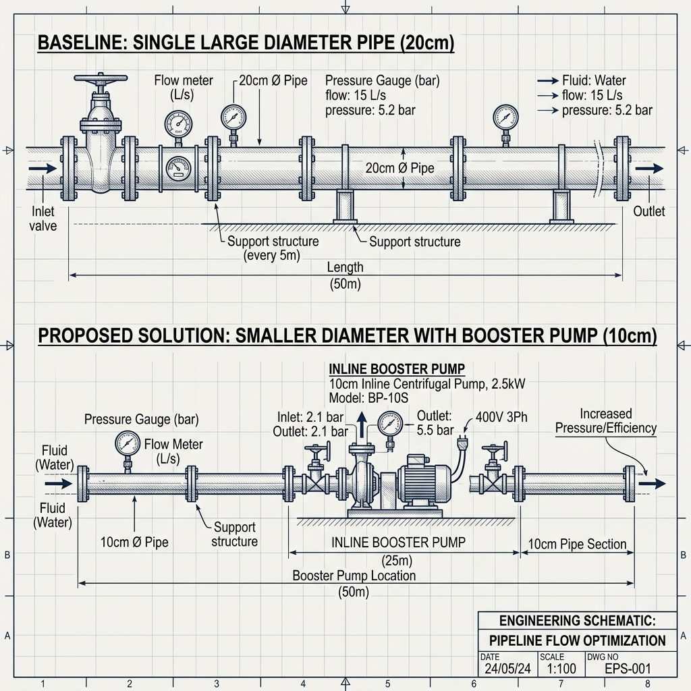

### 3. 레이놀즈 수 난류 유도 권장 원인 (파이프 살균)
* **문제가 되는 상황**: 우유를 파이프 겉에서 열로 데워 살균할 때 속도를 느릿하게 조용히 흘려보내면(층류), 벽에만 닿은 우유는 까맣게 타고 안쪽 센터 우유는 차갑게 통과해 식중독 세균이 생존해 버립니다.
* **해결책**: 강제 풀악셀 펌핑으로 회오리를 돌려대며 속도를 올려 **난류(Turbulent Flow)** 상태를 만듭니다. 이렇게 하면 속과 겉이 계속 회오리로 뒤섞여(Radial Mixing) 타는 놈도 얼어있는 놈도 없이 균일하게 초단기간 퍼펙트 살균됩니다.

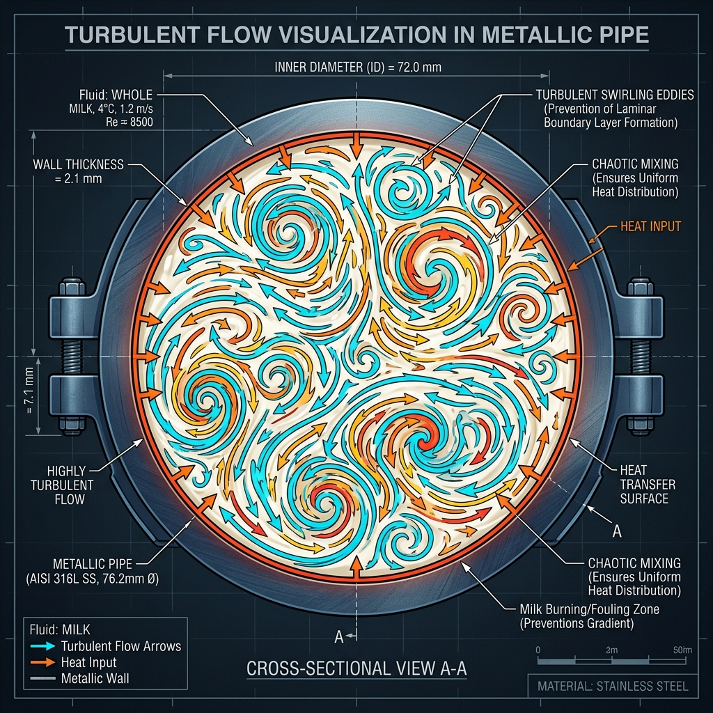

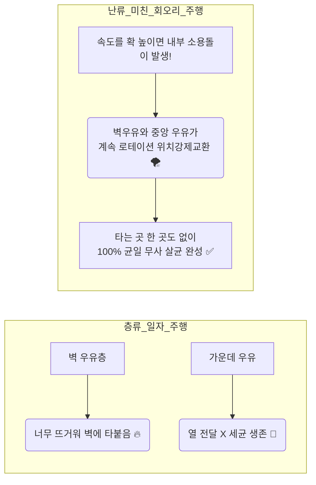
```mermaid
flowchart LR
    subgraph 층류_일자_주행
    A1[벽 우유층] --> B1(너무 뜨거워 벽에 타붙음 🔥)
    A2[가운데 우유] --> B2(열 전달 X 세균 생존 🦠)
    end
    
    subgraph 난류_미친_회오리_주행
    C[속도를 확 높이면 내부 소용돌이 발생!] --> D(벽우유와 중앙 우유가<br>계속 로테이션 위치강제교환 🌪️)
    D --> E[타는 곳 한 곳도 없이<br>100% 균일 무사 살균 완성 ✅]
    end
```

---

## 6주차: 비뉴턴 유체 (복합 거동)

### 1. 전단 담화 파이프내 유속 불균형 위험
* **문제가 되는 상황**: 마요네즈(전단 담화 점도 꺾임 특성)를 밀어버리면, 파이프 플라스틱과 마찰 긁히는 피부 표면 외곽만 액체 맹물로 묽어지고 파이프 중앙부 마요네즈는 아무런 간섭이 없어 **거대한 통나무 고체(Plug Flow)** 상태로 쑤욱 미끄럼틀을 탑니다. 당연히 덩어리라서 중간에 열이 파고들지 못합니다.
* **해결책**: 전동 드릴 칼날이 빙글빙글 파이프 속을 긁으며 중앙으로 마요네즈를 파먹어 혼재시키는 전용 장비 (스크래퍼 긁개식 열 교환기) 파이프관 전개를 필수 적용합니다.

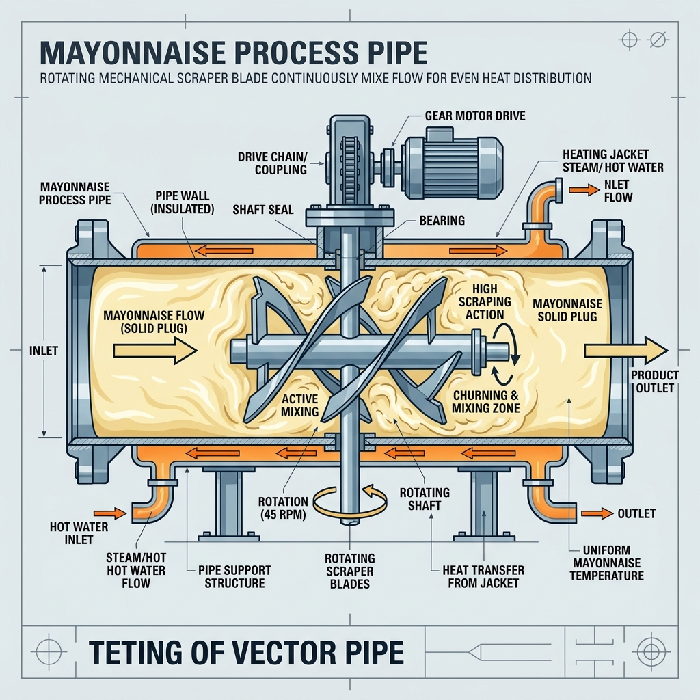

### 2. 항복 응력(Yield Stress)과 초기 펌프 기동
* **문제가 되는 상황**: 월요일 아침 출근. 주말 내 파이프 속에서 잔뜩 얼어 굳어버린 케첩. 이때 기계 끄는 것 급해서 버튼을 풀스위치로 올리면 꽉 막힌 캐첩 저항에 파이프 이음새들이 수류탄 터지듯 "펑!" 폭발합니다(수격 현상 역풍타격).
* **해결책**: 오르막길 자동차 엑셀을 지그시 밟듯, 스위치 펌프를 걸고 RPM을 부드럽고 천천히 가속 승급시키는 **VFD(소프트 스타터 인버터 회로)** 리미터를 반드시 장착하여 잼들을 주물러 마사지 녹이듯 스트레칭 허무는 여유 시간을 가져야 합니다.

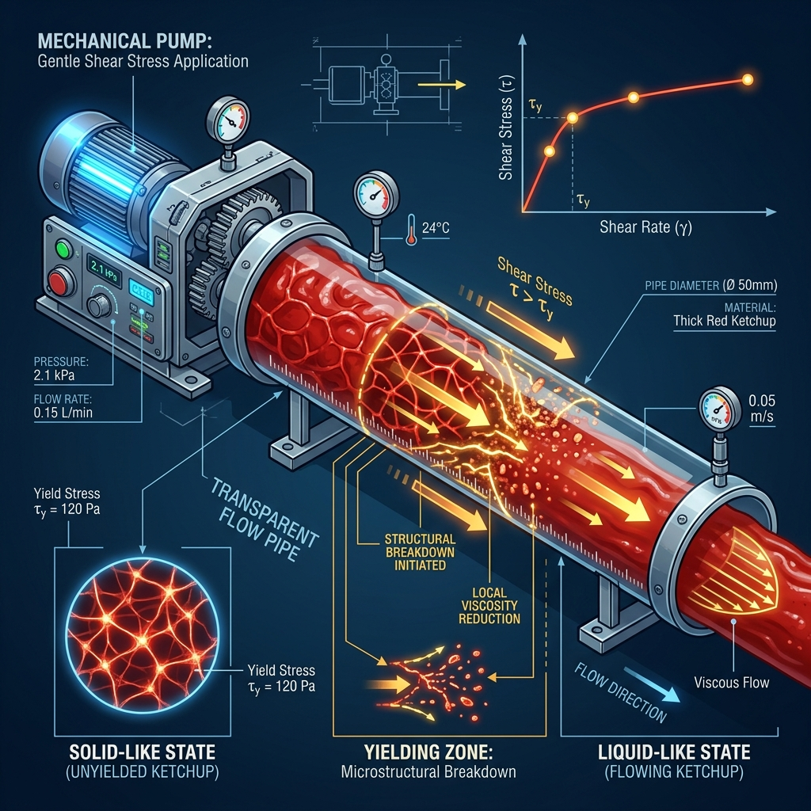

### 3. 전단 농화 유체의 이송 안전 장치
* **문제가 되는 상황**: 녹말물 푼 물이나 특정 특수 진흙액처럼, 주먹으로 빡 건드리면 시멘트 돌처럼 굳어져 버리는 이상한 돌연변이 액체. 이 녀석들은 펌핑 출력을 조금만 쎄개 쏘거나 구부러짐 각도가 기이한 90도 직교 꺾임벽 코너를 박는 순간 "깡" 하면서 고체 돌맹이가 되어 파이프관이 터져 사망합니다.
* **해결책**: 직각 엘보 관을 전면 금지하고 전부 강줄기처럼 완만하게 구부리고, 과압을 받으면 문을 강제 개방하여 유체를 천천히 방류하는 숨구멍 안전 바이패스 밸브를 파이프 군데군데 무지막지 세팅해야 합니다.

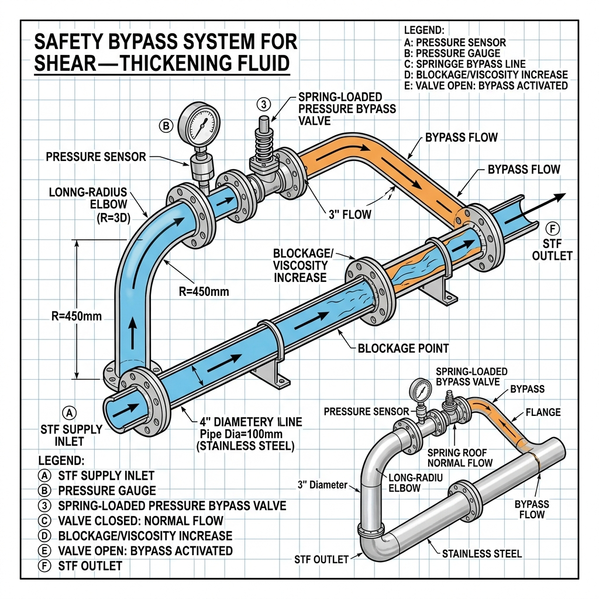

### 4. 요변성(Thixotropy) 딜레이 거동과 배관 루프
* **문제가 되는 상황**: 요그루트 퓨레는 계속 저어 펌핑하면 호스 물처럼 나옵니다. 그런데 딱 공장 밥 점심 식사 1시간 꺼두면 호스 내부 전체 마디마디가 단단한 젤로, 푸딩 고체로 회귀 벽을 쌓아 오후 재가동이 불가해집니다 (요변성 지연 복구 특성 현가).
* **해결책**: 고인물이 썩는 구간인 **Dead Zone(멈춘 구간)**을 배제. 아예 배관을 막지 않고, 공장 전체를 회전 초밥 트랙 고리 링처럼 돌려서, 아주 약한 힘으로라도 계속 빙빙 끊임없이 돌리며 저어 마찰 점도를 파괴하는 "무한 재순환 강제 회전 대기" 파이핑 루프를 설비합니다.

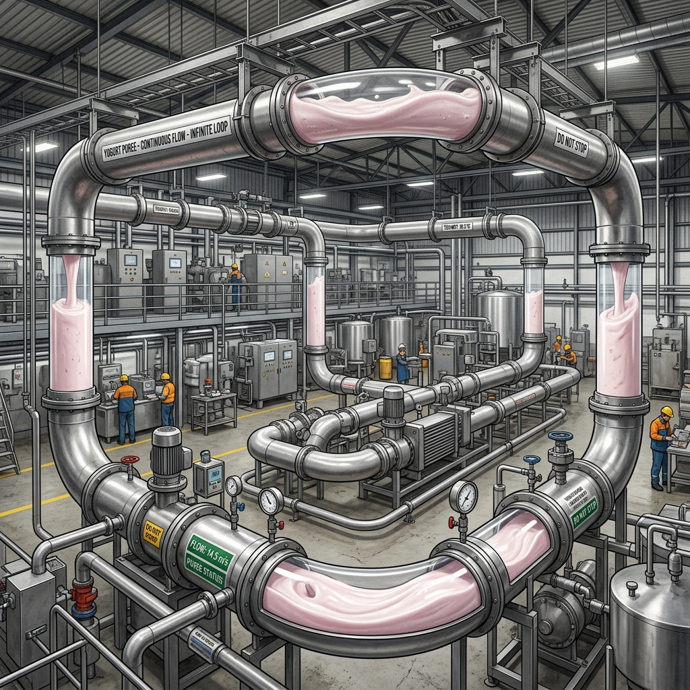

---

## 7주차: 점탄성 특성 (크리프와 응력 이완)

### 1. 온도와 점탄성 이완의 분자적 상관관계 (상온 vs 냉장 탑차)
* **문제가 되는 상황**: 무더운 대낮 아스팔트 상온 25도 개방형 트럭 달릴 때. 뜨거운 열기에 복숭아 세포 안 꿀(점성액체)이 국물처럼 완전 녹아서 노면을 타는 트럭 진동 덜컹 펀치를 받으니 이완 대기시간도 없이 복숭아가 그냥 풍선 찌그러지듯 돌이킬 수 없는 영구 멍이 들어버립니다.
* **해결책**: 영하 빙점에 가까운 4도 냉장 탑차 에어컨 시스템에서 수송 시, 복숭아 꿀과 체액이 찐득끈적 타르화 포메로 단단히 점도 코어를 굳히면서 엄청난 저항 마찰 흡수 서스펜션(대시포트 탄성 저항 보탬) 탱커 쿠션을 형성! 어지간한 바닥 펀치는 무효화 탱커 흡수 튕겨내기 반사 달성에 성공합니다.

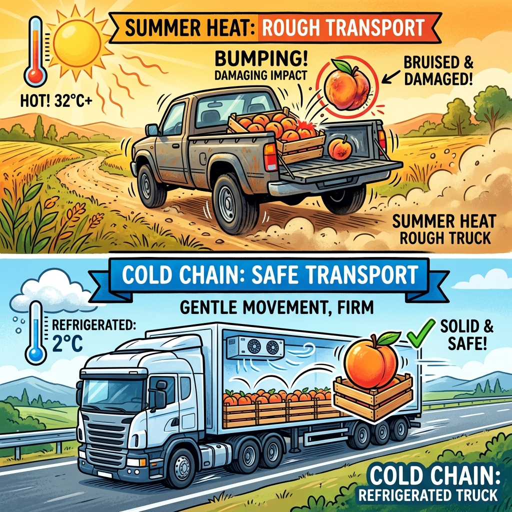

```mermaid
graph LR
    subgraph 상온_25도_트럭_🔥
    A[복숭아 점성 물처럼 묽어짐] -->|노면 방지턱 쾅!| B((쿠션 붕괴<br>찌그렁 멍듬 😭))
    end
    
    subgraph 냉동_4도_트럭_❄️
    C[복숭아 점성 찐득단단 굳건 방어력 10배업] -->|노면 방지턱 쾅!| D((강력쿠션 흡수 튕겨냄<br>탱탱 무결점 출하 🍑))
    end
    
    style B fill:#ffb3ba,stroke:#d93838
    style D fill:#baffc9,stroke:#3bb143
```

### 2. 과숙(Ripening)에 의한 점탄성 물리 열화 기기 자동 감지
* **문제가 되는 상황**: 초록 단단한 사과가 겉모습은 유지하는데 속이 모래주머니처럼 퍼석 늙을 때. 세포를 지탱해 주던 그물 골격인 '펙틴 젤리 다발' 이 다 분해 배제되어 끊겨 있습니다 (사과 계수 E 소멸상태). 
* **해결책**: 레일 위 사과 피부에 가상 스피커 레이저 진동 '둥~' 낮은 대역을 튕기면, 건강한 놈은 바로 탱글 반사 리바운드 치지만, 펙틴 골절 낡은 녀석들은 질퍽질퍽 퍼져버리는 지연 둔탁한 소산 주파수를 발산합니다. 이 미세 주파수를 캐치하면 과일을 직접 칼로 안 찔러보고도 물렁 상태 사과를 색출하는 광역 비파괴 검사장비 레이더망 스펙트럼 운용이 완성.

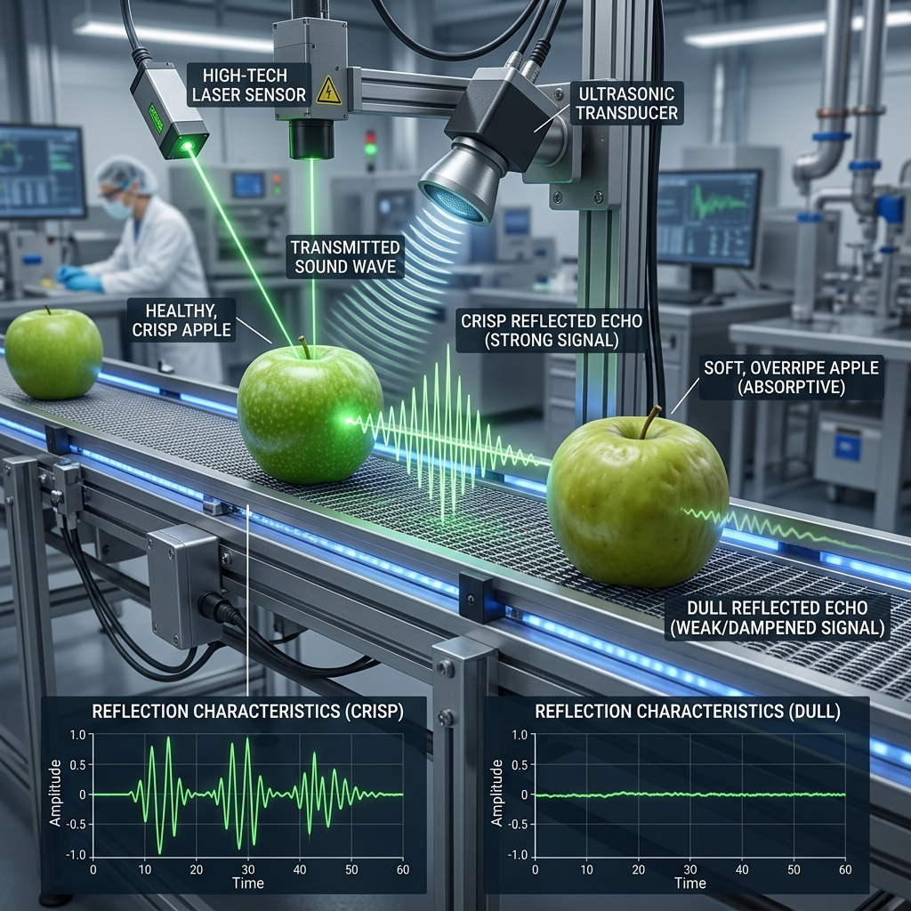

### 3. 고속 수송 간 진동(Vibration) 피로 누적과 크리프 악화
* **문제가 되는 상황**: 사과를 식물 연구소에서 조용히 정지 시켜 누르는 실험 수치(정하중 크리프)만 믿고 그만큼 위에 수박을 올려선 파탄입니다. 트럭이 고속질주하면서 범퍼와 서스펜션을 타고 쉴 새 없이 지진처럼 따다닥 소음 덜컹 폭격을 과일 박스 밑바닥에 갈기면, 멈춰있을 때보다 수만 수천 배 뼈가 빨리 금가고 골절 크랙 균열이 퍼지는 충격가속(Dynamic Fatigue 동차 충격 가속도계수)이 도래.
* **해결책**: 트럭 진동 지수에 맞춰 파괴 공식을 2배속 모드로 악화 곱셉 재적용! 그에 비례해 바스켓 내부 밑창 충격 흡수 골판지 앰보 에어 격벽 쿠션을 현장 수치의 3배 이상 배가시켜 강인 두껍게 포장 방어선을 방벽 설치 증설.

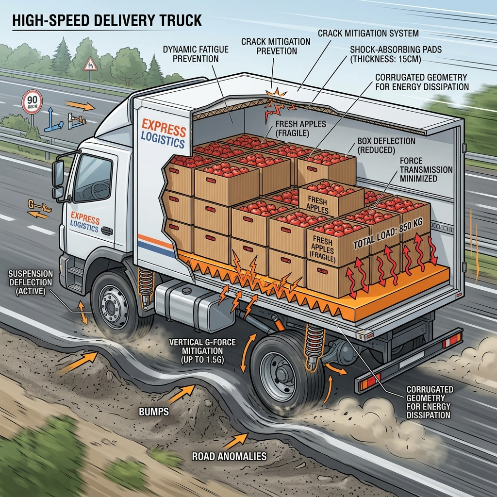

### 4. 물류 박스 적재 단수 최대치 역산 타깃 (과일은 어디까지 버티는가?)
* **문제가 되는 상황**: 토마토 궤짝을 트럭 지붕까지 8층 빌딩 탑 쌓는 게 사장 이익. 허나 당연히 바닥 1층에 깔린 박스 속 불쌍한 토마토는 당장 출발 1시간은 안 깨지고 꿋꿋이 잘 버티나, 심야 야간 12시간 내내 서울-부산 쉴틈 없이 맞고 시달리면 크리프 짓눌림 항체 임계 소멸로 결국 밤 5시 고속도로 톨게이트 전에서 납작 쥬스로 전면 피사.
* **해결책**: 모의 버거스 함수 모델에 토마토 파괴 3% 허가 기준 생계유지선 시간을 대입하여 탑차 도착 시간 12시간짜리를 역계산 대입 추출! 도출 수리가 내어준 결과는 "이 농산품 스펙의 12시간 생명 한계 방어 마진 높이는 5단 박스 탑층 까지입니다!" 이를 판결 선언 공고 배포하여 최적 유통 적재 제한선을 그어 불량품 폐기 비용 제로화를 선도합니다.

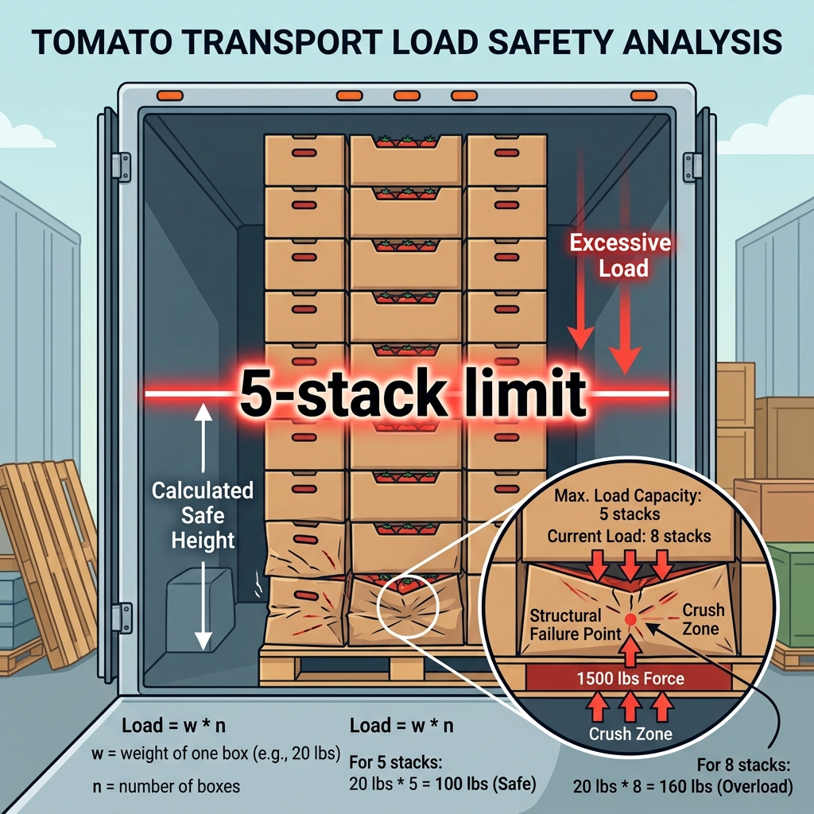
