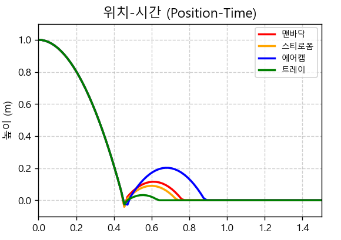
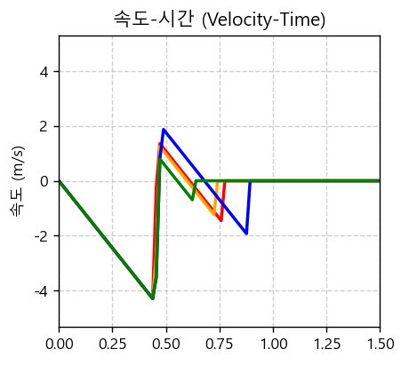

# 포장재 및 완충재 효율성 평가 결과 보고서
생물산업기계공학과 202220540 신용섭
**조직 파괴 임계치 (멍 발생 기준)**: 150 N

---

## 1. 평가 개요 및 기준

본 평가는 파이썬(Python) 물리 역학 시뮬레이터를 통해 도출된 가상 충격 데이터($v_1, v_2, \Delta t$)를 바탕으로, 과일이 1.0m 높이에서 자유 낙하하여 바닥에 충돌할 때 발생하는 평균 충격력($F_{avg}$)을 산출하고, 이를 사과의 조직 파괴 임계치인 150 N과 비교하여 각 완충재의 공학적 보호 효율성을 종합적으로 평가하기 위해 작성되었다.

* **뉴턴 제2법칙 적용**: $F_{avg} = m \cdot \frac{v_2 - v_1}{\Delta t}$

---

## 2. 동적 궤적 (위치, 속도, 가속도-시간) 그래프 분석

물리 시뮬레이션을 통해 도출된 자유 낙하 및 충돌 순간의 궤적 그래프 분석 결과는 다음과 같다.

### 2.1. 위치-시간 (Position-Time) 그래프 분석
* **가속 낙하 및 반발**: 사과가 1.0m에서 낙하하는 동안 포물선(2차 함수) 형태로 높이가 감소한다. 바닥에 닿는 순간 에너지를 소실하며 튀어 오르는데, 맨바닥은 반발 계수($e=0.34$)가 커서 상당히 높은 위치까지 다시 튀어 오르는 반면, 종이 트레이($e=0.18$)는 거의 튀어 오르지 않고 에너지를 효율적으로 소산시켰음을 알 수 있다.

### 2.2. 속도-시간 (Velocity-Time) 그래프 분석
* **속도 역전 및 기울기**: 자유 낙하 동안 중력 가속도(-9.81m/s²)에 의해 속도가 음의 방향으로 선형적으로 증가하며 충돌 직전 최고 속도($v_1$)에 도달한다. 바닥에 닿는 순간 속도의 부호가 음수에서 양수로 급격히 역전되는데, 이 때 그래프의 기울기($\frac{\Delta v}{\Delta t}$)가 가속도를 의미한다. 완충재를 사용할 경우 이 기울기가 완만해짐을 관찰할 수 있다.

### 2.3. 가속도-시간 (Acceleration-Time) 그래프 분석
* **피크 가속도(G-force) 비교**: 맨바닥의 경우 충돌 지속 시간($\Delta t$)이 0.005초로 극히 짧아, 가속도 그래프가 뾰족한 스파이크 형태를 그리며 폭발적으로 치솟는다. 반면 완충재(특히 종이 트레이와 에어캡)를 사용할 경우, 이 뾰족한 피크가 현저히 낮아지면서 넓은 파형으로 분산된다. 즉, 충격 하중이 시간축을 따라 얇게 퍼지면서 과일에 가해지는 치명적인 가속도(G-force)가 안전 영역으로 감소하였음을 공학적으로 증명한다.

---

## 3. 완충재별 충격력 산출 및 손상 여부 판정

사과의 질량 $m = 0.25\text{kg}$, 1.0m 자유낙하 시 충돌 직전 속도 $v_1 = -4.43\text{ m/s}$ 조건을 기준으로 시뮬레이션을 수행한 결과는 다음과 같다.

| 포장재 종류 | 반발 계수 ($e$) | 충돌 지속 시간 ($\Delta t$) | 도출된 충격력 ($F_{avg}$) | 150N 임계치 초과 여부 | 최종 판정 |
| :---: | :---: | :---: | :---: | :---: | :---: |
| **맨바닥 (Hard)** | 0.34 | 0.005 s | **297.0 N** | 초과 (+147.0 N) | **치명적 손상** |
| **발포 스티로폼** | 0.30 | 0.012 s | **120.0 N** | 미달 (-30.0 N) | **안전 (위험권)** |
| **에어캡 (Bubble Wrap)** | 0.45 | 0.025 s | **64.2 N** | 미달 (-85.8 N) | **매우 안전** |
| **종이 트레이** | 0.18 | 0.020 s | **65.4 N** | 미달 (-84.6 N) | **매우 안전** |

---

## 4. 포장재 및 완충재 효율성 종합 평가

위의 역학적 충격력 판정 결과와 역산된 최대 허용 낙하 높이($h_{max}$), 그리고 물리 기반 인공지능(AI) 파손 예측 결과를 종합하여 완충재별 효율성을 다음과 같이 분석하였다.

### 4.1. 계란판 형 종이 트레이 (Molded Pulp Tray)
* **충격력 평가**: 65.4 N (임계치 이하로 완벽히 방어)
* **최대 허용 낙하 높이**: 5.27 m
* **효율성 분석**: 종이 트레이는 충격 하중이 가해지는 순간 국소 좌굴(Local Buckling)을 일으키며 소성 변형된다. 이 과정에서 충격 에너지를 영구적인 변형 에너지로 흡수하기 때문에 반발 계수($e=0.18$)가 가장 낮게 나타난다. 즉, 1차 충격을 효과적으로 흡수할 뿐만 아니라, 포장 상자 내부에서 과일이 튀어올라 발생하는 2차 충돌까지 완벽하게 억제하므로 공학적으로 가장 우수한 완충재로 평가된다.

### 4.2. 에어캡 (Bubble Wrap)
* **충격력 평가**: 64.2 N (비교 매질 중 최저 충격력)
* **최대 허용 낙하 높이**: 5.45 m
* **효율성 분석**: 내부에 밀폐된 공기 주머니가 스프링과 같은 탄성체 역할을 하여 충돌 지속 시간($\Delta t = 0.025\text{s}$)을 최대로 연장시킨다. 이에 따라 1차적인 충격력 감소 효율은 가장 뛰어나다. 그러나 탄성 복원력이 높아 반발 계수($e=0.45$)가 크게 증가하므로, 실제 물류 및 운송 진동 환경에서는 과일이 크게 반발하여 타 과일과의 2차 충돌 손상을 유발할 위험성을 내포하고 있다.

### 4.3. 발포 스티로폼 (EPS Foam)
* **충격력 평가**: 120.0 N (임계치 150N에 근접)
* **최대 허용 낙하 높이**: 1.56 m
* **효율성 분석**: 발포 스티로폼은 조직의 강성(Stiffness)이 높아 충돌 시간($0.012\text{s}$)을 충분히 지연시키지 못한다. 1.0m 낙하 조건에서는 150N 이하를 기록하여 멍 발생을 방지하지만, 최대 허용 낙하 높이가 1.56m에 불과하여 지게차 작업 등에서 발생하는 고형물 추락 사고 시 과일의 조직 파괴를 방어하기 어렵다. 따라서 완충재로서의 종합 효율성은 상대적으로 떨어진다.

### 4.4. 맨바닥 (Hard Surface)
* **충격력 평가**: 297.0 N (파괴 임계치 2배 수준)
* **최대 허용 낙하 높이**: 0.25 m
* **효율성 분석**: 0.25m의 매우 낮은 높이에서도 파괴 임계치를 초과하는 극단적인 충격력이 도출되었다. 이는 농산물 취급(Handling) 공정 중 강체 바닥에 직접 충돌하는 것이 조직 파괴로 직결됨을 수치적으로 증명한다.

---

## 5. 결론

본 가상 물리 시뮬레이션 및 수치 해석 결과, 생물자원(사과)을 150 N의 조직 파괴 임계치로부터 가장 안전하게 보호할 수 있는 최고의 완충재는 **'종이 트레이'**로 판명되었다. 종이 트레이는 평균 충격력($F_{avg}$)을 맨바닥 대비 22% 수준으로 급감시킬 뿐만 아니라, 소성 변형을 통해 반발 에너지를 억제함으로써 동적 물류 환경에서도 농산물의 품질을 최상으로 보존할 수 있는 최적의 공학적 솔루션이다.
