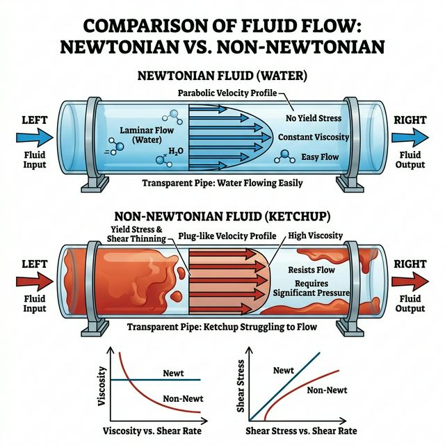
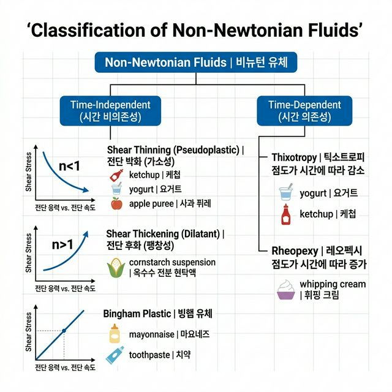
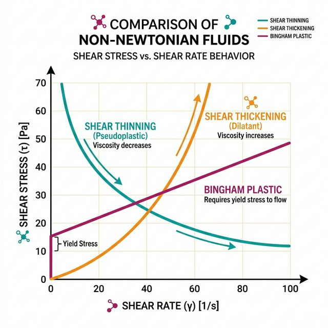
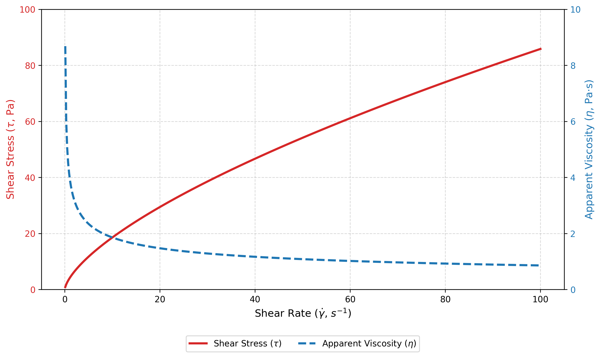
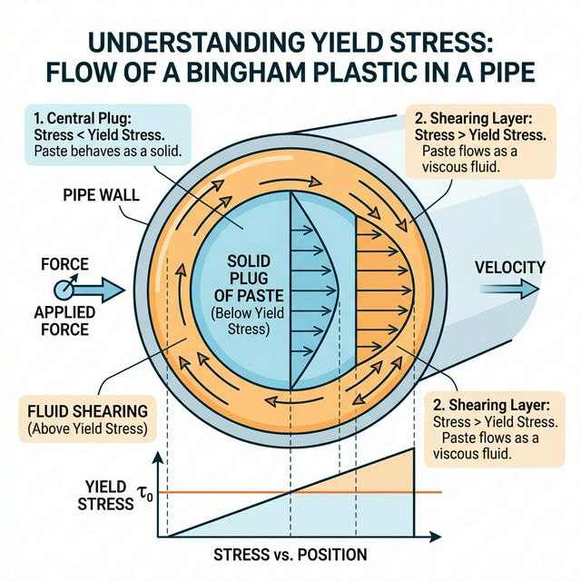
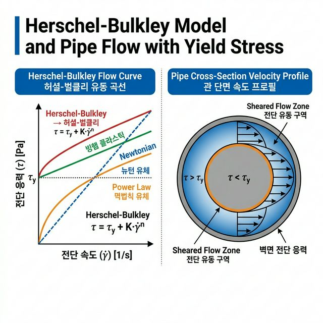
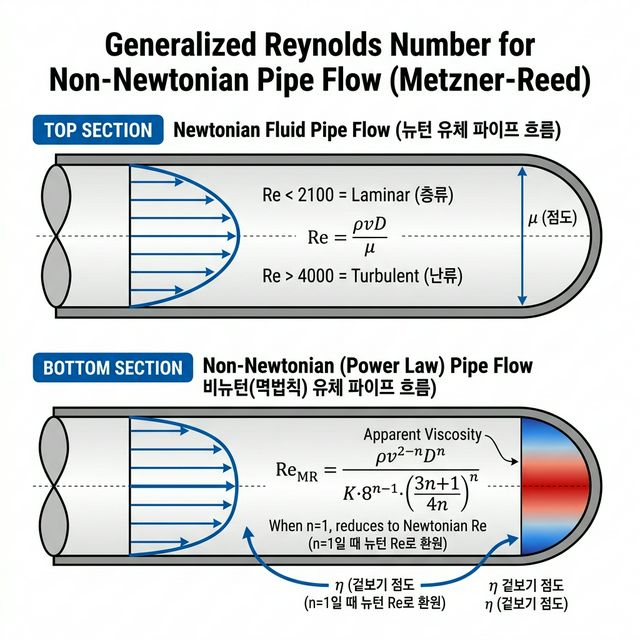

# 🧪 6주차 실습: 비뉴턴 유체의 복합 거동 (Non-Newtonian Fluids)
**– Power Law 모델 커브 피팅, 겉보기 점도 동적 시뮬레이션 및 Herschel-Bulkley 항복 응력 분석 –**

> 📂 **네비게이션**: [← 5주차: 유변학적 특성 (뉴턴 유체)](../week5/05주차_실습_유변학적특성.md) · [메인 README](../../README.md) · [📝 퀴즈 뱅크](../../QUIZ_BANK.md)

---

## 0. 실습 대상 데이터: 비뉴턴 유체 전단 응력 측정 데이터

본 실습은 가공 현장에서 자주 다루는 '전분 풀(Pseudoplastic Fluid 가정)'의 회전 점도계 측정 데이터를 활용

| 전단 속도 (Shear Rate, $s^{-1}$) | 전단 응력 (Shear Stress, Pa) 측정치 |
|:---:|:---:|
| 10 | 18.5 |
| 20 | 29.3 |
| 30 | 38.5 |
| 40 | 46.8 |
| 50 | 54.3 |
| 60 | 61.2 |
| 70 | 67.8 |
| 80 | 74.0 |
| 90 | 80.0 |
| 100 | 85.8 |

<br>


---

## 1. 이론적 배경: 비뉴턴 유체의 유변학적 특성

### 1-1. 비뉴턴 유체의 정의 및 분류





- **개념**: 전단 응력과 전단 속도의 관계가 비선형(Non-linear)인 유체
- **핵심 차이**: 뉴턴 유체(5주차)는 점도 $\mu$ 일정 → 비뉴턴 유체는 전단 속도에 따라 **겉보기 점도** 능동 변동
- **시간 독립형 분류**
  - `전단 담화(Pseudoplastic)`: 전단 속도 ↑ → 점도 ↓ (케첩, 사과 퓨레, 요거트)
  - `전단 농화(Dilatant)`: 전단 속도 ↑ → 점도 ↑ (옥수수 전분 현탁액)
  - `빙햄 플라스틱(Bingham Plastic)`: 항복 응력($\tau_y$) 초과 시 유동 개시 (마요네즈, 치약)
- **시간 의존형 분류**
  - `요변성(Thixotropy)`: 전단 지속 시 점도 점진 감소 → 해제 시 복원 (요거트, 케첩)
  - `레오펙시(Rheopexy)`: 전단 지속 시 점도 점진 증가 → 해제 시 복원 (휘핑 크림)

### 1-2. Power Law 모델 (멱법칙 모델)





- **수식**: $\tau = K \cdot \dot{\gamma}^n$
  - $K$ (농도 계수, Consistency Index): 유체의 전반적 끈적임 지표 ($Pa \cdot s^n$)
  - $n$ (유동 지수, Flow Behavior Index): 뉴턴 유체($n=1$) 기준 이탈 정도
- **판별 기준**

| $n$ 값 | 유체 분류 | 겉보기 점도 추이 |
|:---:|:---|:---|
| $n = 1$ | 뉴턴 유체 | 전단 속도 무관, $\eta = K$ 일정 |
| $n < 1$ | 전단 담화 | 전단 속도 ↑ → $\eta$ 감소 |
| $n > 1$ | 전단 농화 | 전단 속도 ↑ → $\eta$ 증가 |

- **겉보기 점도 유도**: $\eta = K \cdot \dot{\gamma}^{n-1}$ → 비뉴턴 유체의 순시적 점성 평가 핵심 공식

### 1-3. Herschel-Bulkley 모델 (항복 응력 포함 확장 모델)





- **수식**: $\tau = \tau_y + K \cdot \dot{\gamma}^n$
  - $\tau_y$: 항복 응력 (Pa) — 유동 개시 임계선
  - 3개 파라미터($\tau_y$, $K$, $n$)로 거의 모든 비뉴턴 거동 포괄
- **특수 케이스 관계**

| 모델 유형 | $\tau_y$ | $n$ | 비고 |
|:---:|:---:|:---:|:---|
| 뉴턴 유체 | 0 | 1 | $\tau = \mu \dot{\gamma}$ |
| Power Law | 0 | $\neq 1$ | $\tau = K \dot{\gamma}^n$ |
| Bingham Plastic | $> 0$ | 1 | $\tau = \tau_y + \mu_p \dot{\gamma}$ |
| Herschel-Bulkley | $> 0$ | $\neq 1$ | 범용 마스터 모델 |

- **파이프 내 함의**: 벽면 부근(전단 응력 > $\tau_y$) → 유동 영역 / 중심부(전단 응력 < $\tau_y$) → 비유동 플러그 형성

### 1-4. 일반화 레이놀즈 수 (Metzner-Reed)



- **5주차 뉴턴 유체**: $Re = \rho v D / \mu$ (점도 상수)
- **비뉴턴 유체 도전**: 위치별 겉보기 점도 변동 → 단일 $\mu$ 대입 불가
- **Metzner-Reed 일반화 레이놀즈 수**:

$$Re_{MR} = \frac{\rho \cdot v^{2-n} \cdot D^n}{K \cdot 8^{n-1} \cdot \left(\frac{3n+1}{4n}\right)^n}$$

- $n=1$, $K=\mu$ 대입 시 뉴턴 유체 $Re$로 자동 환원
- $Re_{MR} < 2100$: 층류 / $Re_{MR} > 4000$: 난류

---

## 2. 파이썬 알고리즘 실습: Power Law 피팅 및 유변학 시뮬레이션

본 과정은 유동 지수($n$)와 농도 계수($K$)를 비선형 회귀 알고리즘으로 동적 추출하고, 겉보기 점도 및 항복 응력 거동을 인터랙티브 시뮬레이터로 탐색하는 훈련 파이프라인으로 구성

### 📝 [필수] 환경 설정 및 실행 가이드
1. **패키지 설치 확인**: `scipy` 모듈 필수
   ```bash
   pip install numpy matplotlib scipy
   ```
2. **파일 위치**: `ko/week6/` 디렉토리 내 파이썬 스크립트 실행
3. **실행 명령**: 
   ```bash
   python step1_powerlaw_curve_fit.py      # Power Law 곡선 피팅
   python step2_apparent_viscosity.py      # 겉보기 점도 슬라이더 시뮬레이터
   python step3_herschel_bulkley_yield.py  # Herschel-Bulkley 항복 응력 분석
   ```

---

### 📊 파이썬 스크립트 핵심 해설 (Step 1 ~ Step 3)

#### 2-1. [Step 1] Power Law 모델 곡선 피팅 추정
- **알고리즘 코어**: `scipy.optimize.curve_fit` 함수를 동원하여 비선형 최소제곱 오차 역산
- **입력 데이터**: 회전 점도계 가상 측정치 (전분 풀 가정, 전단 속도 10~100 $s^{-1}$)
- **핵심 로직**:
  ```python
  from scipy.optimize import curve_fit
  
  def power_law(gamma_dot, K, n):
      return K * gamma_dot ** n
  
  popt, pcov = curve_fit(power_law, shear_rate_data, shear_stress_data)
  K_est, n_est = popt
  ```
- **결과 인사이트**: $n$ 추정치가 $1$ 미만(약 0.85) → 자동으로 '전단 담화(Pseudoplastic)' 유체 판정
- **시각화**: 실험 산점도(파란 원) + 피팅 곡선(적색 실선) 중첩 플로팅

#### 2-2. 🎛️ [Step 2] 겉보기 점도 대화형 슬라이더 애니메이션
- **수식 기반**: $\eta = K \cdot \dot{\gamma}^{n-1}$
- **UI 조작 인터페이스**: 하단 Slider 위젯으로 $n$ 값을 0.2 ~ 1.8 구간 드래그
- **관찰 포인트**
  - $n < 1$ (전단 담화 영역): 겉보기 점도 곡선이 우측 하향 '폭포수형' 즉시 스위칭
  - $n = 1$ (뉴턴 영역): 수평 직선 (점도 일정)
  - $n > 1$ (전단 농화 영역): 우측 상향 곡선으로 점도 폭증 시각화
- **공정 연계**: 파이프 내벽 마찰 지수 설계 시 유동 지수별 펌프 운전 마진폭 분석

#### 2-3. 💥 [Step 3] Herschel-Bulkley 항복 응력 분석 위젯
- **수식 기반**: $\tau = \tau_y + K \cdot \dot{\gamma}^n$
- **UI 조작 인터페이스**: $\tau_y$(항복 응력)와 $n$(유동 지수) 듀얼 슬라이더
- **관찰 포인트**
  - $\tau_y$ 증가 시 → 전체 피팅 곡선의 y절편 상승 → 초기 펌프 기동 임계 압력 마진폭 직관적 확인
  - $n$ 감소 시 → 항복 초과 후 곡선의 비선형 정도 심화 (전단 담화 복합)
  - 빨간 점선 = 항복 응력 수평선 → 이 선 아래에서는 유동 불가(고체 거동)
- **파이프 설계 연계**: 펌프 모터 기동 초창기, 막힌 파이프를 강제로 뚫어내기 위한 임계 응력 사전 산출

#### 2-4. 🚀 [Advanced] 로그-로그 스케일 선형화 검증 챌린지
- **목적**: Power Law의 로그 변환 $\log(\tau) = \log(K) + n \cdot \log(\dot{\gamma})$ 직선성 검증
- **실습 과제**:
  1. Step 1의 데이터를 양 축 로그 변환 → `np.log10()` 적용
  2. `np.polyfit(log_gamma, log_tau, 1)` 으로 1차 선형 회귀 수행
  3. 기울기 = $n$, y절편 = $\log(K)$ 도출 → `curve_fit` 결과와 비교 검증
- **관찰 포인트**: 두 방법의 $K$, $n$ 추정치 일치 여부 확인 → 산업 현장 퀵 피팅 방법론 실무 체득

#### 2-5. 🚀 [Advanced] 대상 유체 변경 챌린지: 토마토 케첩 데이터 적용
- **목적**: 기초 실습 코드를 응용하여 실제 식품의 Power Law 파라미터 도출
- **실습 과제**: Step 1의 전분 풀 데이터를 아래 토마토 케첩 데이터로 변경 후 재실행

| 전단 속도 ($s^{-1}$) | 전단 응력 (Pa) |
|:---:|:---:|
| 5 | 32.0 |
| 10 | 40.5 |
| 20 | 52.1 |
| 50 | 70.8 |
| 100 | 89.2 |

- **관찰 포인트**: 전분 풀 대비 $n$ 값이 **더 낮게** 추정됨 → 케첩의 극심한 전단 담화 경향 확인
- **추가 과제**: Herschel-Bulkley 모델로 피팅하여 항복 응력($\tau_y$) 존재 여부 추가 검증

---

## 3. 💡 심화 토론 주제 (Discussion Topics)

### 토론 1: 전단 담화 현상과 파이프 내 유속 불균형
- **배경**: $n<1$인 전단 담화 유체는 벽면 부근(고 전단 속도 영역)에서는 묽어지고, 중심부(저 전단 속도 영역)에서는 점도 유지
- **논제**: 이러한 반경별 '점도 불균형' 현상이 열교환기 내부 살균 효율에 뉴턴 유체 대비 긍정적으로 작용할지, 치명적 악재로 작용할지 역학적 토론 요망

### 토론 2: 항복 응력(Yield Stress)과 초기 펌프 기동
- **배경**: Herschel-Bulkley 모델은 항복 응력($\tau_y$) 이상의 초기 전단력 인가 시 유동 개시
- **논제**: 긴 연휴 후 파이프라인 내부에 정지 고형화된 고농도 페이스트 재이송 시 펌프 기동 토크 설계 주의점 및 배관 내 파손 위험 요소 토론

### 토론 3: 전단 농화 유체와 이송 안전 장치 (Relief Valve)
- **배경**: 옥수수 전분 현탁액 수송관($n>1$)에서 펌프 임펠러 회전 속도 급증 시 → 관 내부 유체 순간 고체화 → 모터 축 파손 또는 파이프 파열 위험
- **논제**: 전단 농화 유체 이송 파이프라인에서 시스템 압력 과부하 시 안전 밸브(Safety Relief Valve)를 어떻게 설계·배치해야 치명적 폭발을 가장 신속하게 방지할 수 있는가?

### 토론 4: 파워 로우 피팅 오차와 $R^2$ 신뢰도 한계
- **배경**: 곡선 피팅의 $R^2$ 결정계수 0.8 미만 노이즈 데이터를 설계에 반영 시 큰 위험 초래
- **논제**: 점도계 센서 오차, 샘플 내 기포, 온도 변동 등에 의해 측정 데이터 산포도가 극심할 때, 파이썬 기반 이상치(Outlier) 탐지 및 제거 알고리즘(IQR, Z-score 등) 추가 방안 공학적 제안

### 토론 5: 요변성(Thixotropy) 유체의 배관 설계 문제
- **배경**: 요거트, 사과 퓨레 등 요변성 유체는 지속 전단 시 점도 감소 → 전단 해제 시 점도 복원 (시간 의존형)
- **논제**: 요변성 유체를 장거리 배관으로 이송 시, 배관 중간에 정류 밸브를 설치하면 순간적으로 점도가 회복되어 재기동 시 추가 펌프 부하가 발생할 수 있음. 이러한 요변성 이력(History) 현상을 배관 설계에 어떻게 반영해야 하는가?

### 토론 6: 비뉴턴 유체 배관의 일반화 레이놀즈 수 적용
- **배경**: Metzner-Reed 일반화 레이놀즈 수($Re_{MR}$)는 Power Law 유체의 층류/난류 판별에 사용
- **논제**: $n$ 값이 극단적으로 낮은 ($n \approx 0.2$) 전단 담화 유체의 경우, $Re_{MR}$ 기반 층류/난류 판별 기준이 뉴턴 유체($Re = 2100$)와 동일하게 적용 가능한가? 차이점이 존재한다면 어떤 보정이 필요한가?

---

## 4. 📝 평가용 퀴즈 문항 (Quiz Questions)

### Q1. [이론] 비뉴턴 유체의 정의 파악
다음 중 비뉴턴 유체(Non-Newtonian Fluid)의 핵심 특성을 가장 올바르게 기술한 항목은?
- [ ] A. 전단 응력과 전단 속도가 원점을 통과하는 완전한 직선 비례 관계
- [x] B. 전단 속도에 따라 겉보기 점도(Apparent Viscosity)가 변동하는 비선형 거동
- [ ] C. 온도에만 의존하여 점도가 변동하는 특성
- [ ] D. 밀도가 전단 속도에 비례하여 증가하는 현상

### Q2. [이론] Power Law 유동 지수($n$) 판별
Power Law 모델 $\tau = K \dot{\gamma}^n$에서 유동 지수 $n = 0.35$로 추정된 유체의 거동 유형은?
- [x] A. 전단 담화 (Pseudoplastic / Shear Thinning) — 전단 속도 ↑ 시 점도 ↓
- [ ] B. 전단 농화 (Dilatant / Shear Thickening) — 전단 속도 ↑ 시 점도 ↑
- [ ] C. 뉴턴 유체 (Newtonian) — 점도 일정 유지
- [ ] D. 빙햄 플라스틱 — 항복 응력 이후 유동 개시

### Q3. [이론] 겉보기 점도(Apparent Viscosity) 수식 유도
비뉴턴 유체의 겉보기 점도 $\eta$를 Power Law 모델에서 유도한 올바른 수식은?
- [ ] A. $\eta = K \cdot \dot{\gamma}^n$
- [x] B. $\eta = K \cdot \dot{\gamma}^{n-1}$
- [ ] C. $\eta = K / \dot{\gamma}^n$
- [ ] D. $\eta = \tau_y + K \cdot \dot{\gamma}^n$

### Q4. [이론] Herschel-Bulkley 모델 특수 케이스
Herschel-Bulkley 방정식 $\tau = \tau_y + K \dot{\gamma}^n$에서 항복 응력 $\tau_y = 0$으로 설정하면 어떤 모델로 환원되는가?
- [ ] A. 뉴턴 유체 모델
- [x] B. Power Law 모델
- [ ] C. Bingham Plastic 모델
- [ ] D. 아레니우스 점도 모델

### Q5. [이론] 요변성(Thixotropy) 거동 이해
요변성(Thixotropy) 유체의 핵심 특성으로 가장 올바른 설명은?
- [ ] A. 전단 속도 증가 시 점도가 즉각적으로 감소하는 비시간 의존적 거동
- [x] B. 일정 전단 지속 시 점도가 시간에 비례하여 점진 감소 → 전단 해제 시 점도 복원
- [ ] C. 전단 지속 시 점도가 점진 증가하는 레오펙시(Rheopexy) 거동
- [ ] D. 항복 응력을 넘겨야 유동이 시작되는 빙햄 플라스틱 거동

### Q6. [파이썬 함수] 비선형 커브 피팅 모듈
Power Law 모델 $\tau = K \dot{\gamma}^n$의 최적 파라미터 $K$, $n$을 역산 추정하기 위해 사용되는 `scipy` 모듈의 핵심 함수는?
- [ ] A. `scipy.interpolate.CubicSpline`
- [x] B. `scipy.optimize.curve_fit`
- [ ] C. `scipy.integrate.simpson`
- [ ] D. `scipy.stats.linregress`

### Q7. [파이썬 모듈] 인터랙티브 슬라이더 위젯
Step 2, Step 3 실습에서 $n$ 값과 $\tau_y$ 값을 실시간으로 조작하기 위해 사용된 Matplotlib 위젯 모듈은?
- [ ] A. `matplotlib.animation.FuncAnimation`
- [ ] B. `matplotlib.patches.Circle`
- [x] C. `matplotlib.widgets.Slider`
- [ ] D. `matplotlib.colors.Normalize`

### Q8. [이론] 비뉴턴 유체 배관 설계
토마토 페이스트($n \approx 0.3$, $\tau_y \approx 20$ Pa)를 100m 파이프라인으로 이송 시 가장 적절한 펌프 유형은?
- [ ] A. 원심 펌프 (Centrifugal Pump) — 고속 회전으로 점도 저감
- [x] B. 용적식 펌프 (Positive Displacement Pump) — 항복 응력 극복 및 일정 유량 확보
- [ ] C. 진공 펌프 (Vacuum Pump) — 흡입 압력으로 점성 저감
- [ ] D. 제트 펌프 (Jet Pump) — 인젝터 방식 유체 가속

---

## 5. 실습 평가 및 과제물 제출

- **필수 제출물**
  - `step1_powerlaw_curve_fit.py` 구동 후 산출된 피팅 방정식 콘솔 텍스트 스크린샷 1장
  - `step3_herschel_bulkley_yield.py`에서 $n=0.5$, $\tau_y=15.0$ 세팅 후 스크린샷 1장
- **심화 제출물 (가산점)**
  - [Advanced] 로그-로그 스케일 선형화 코드 및 결과 비교 스크린샷 1장
  - [Advanced] 토마토 케첩 데이터 적용 후 $K$, $n$ 비교표 작성
- 깃허브 `week6` 브랜치에 코드 정상 구동 검증 후 Push 규정 준수
- 자세한 GitHub 초기 연동 및 과제 제출(Push) 방법은 최상위 디렉터리의 [통합 실습 제출 가이드](../../README.md) 참조
