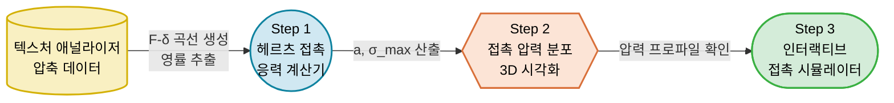
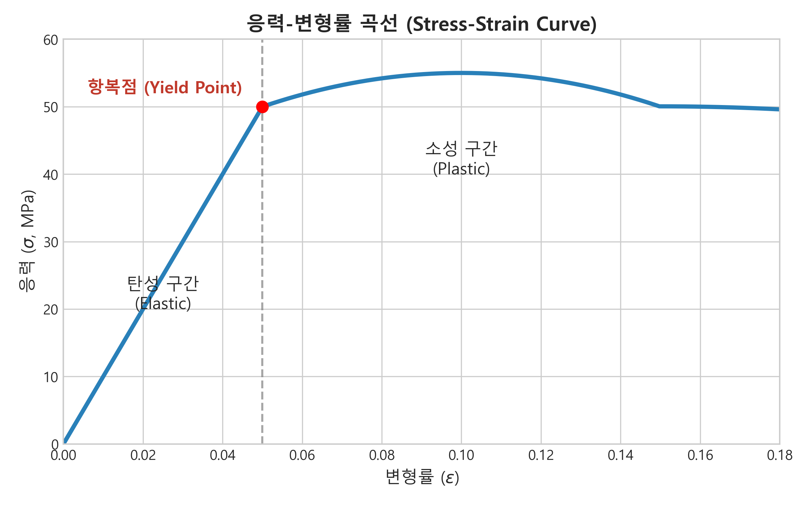
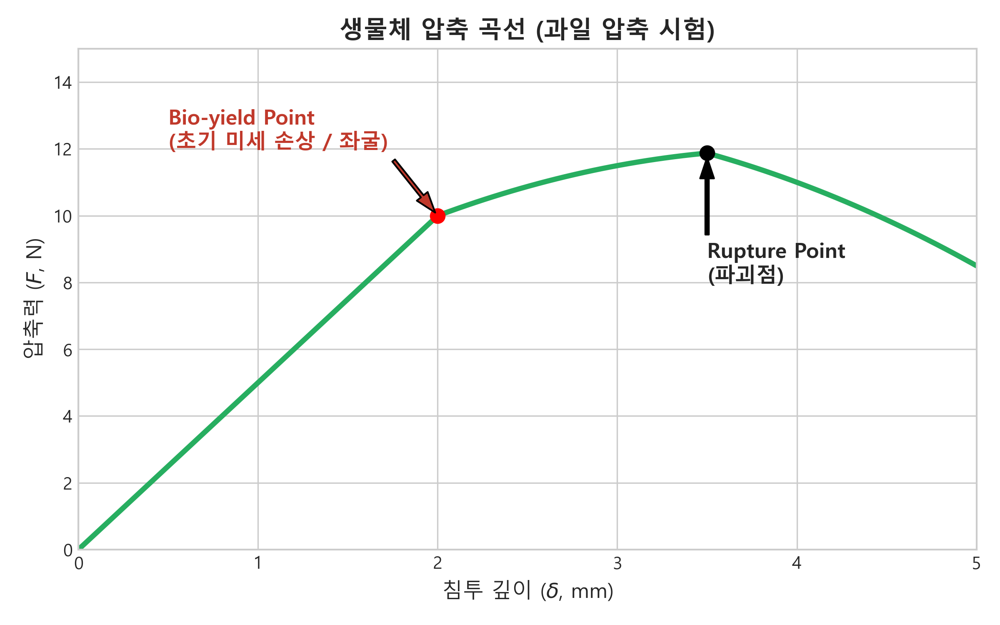
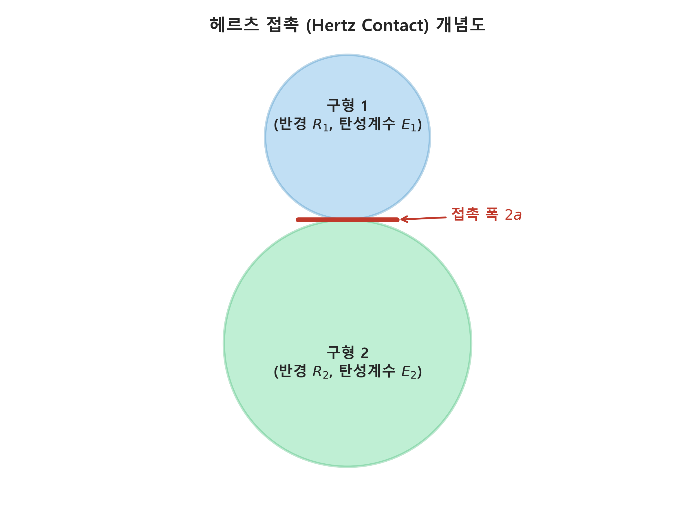
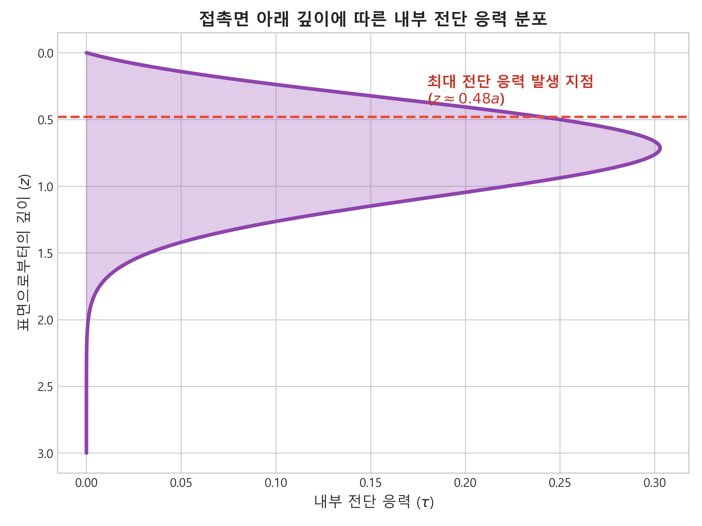

# 🔬 9주차 실습: 접촉 응력과 헤르츠 이론 (Contact Stress & Hertz Theory)
**– 헤르츠 접촉 응력 계산기, 압력 분포 3D 시각화 및 인터랙티브 시뮬레이터 –**

> 📂 **네비게이션**: [← 7주차: 점탄성 특성](../week7/07주차_실습_점탄성특성.md) · [메인 README](../../README.md) · [📝 퀴즈 뱅크](../../QUIZ_BANK.md)

---

## 0. 실습 대상 데이터: 사과(Fuji) 압축 시험 측정 데이터

본 실습은 텍스처 애널라이저(TA.XT Plus)로 측정한 사과 시편의 구형 프로브 압축 데이터를 활용

| 압축력 $F$ (N) | 침투 깊이 $\delta$ (mm) | 비고 |
|:---:|:---:|:---|
| 0.5 | 0.12 | 초기 순응 구간 |
| 1.0 | 0.28 | 선형 탄성 구간 |
| 2.0 | 0.58 | 선형 탄성 구간 |
| 3.0 | 0.92 | 선형 탄성 구간 |
| 5.0 | 1.65 | 항복 근접 구간 |
| 7.0 | 2.45 | Bio-yield 부근 |
| 10.0 | 3.80 | 항복 후 소성 구간 |
| 15.0 | 6.20 | 파괴점 근접 |

<br>



---

## 1. 이론적 배경: 접촉 역학과 헤르츠 이론

### 1-1. 응력(Stress)과 변형률(Strain)의 기초



- **응력**: $\sigma = F/A$ (단위: Pa) — 외력에 의한 내부 저항력의 세기
- **변형률**: $\varepsilon = \Delta L / L_0$ (무차원) — 원래 길이 대비 변형량 비율
- **영률 (Young's Modulus)**: $E = \sigma / \varepsilon$ — 재료의 강성(Stiffness) 지표
- **포아송 비**: $\nu = -\varepsilon_{lateral} / \varepsilon_{axial}$ — 축 방향 변형 대비 측면 팽창 비율

### 1-2. 생물체 항복점(Bio-yield Point)



- **정의**: 응력-변형률 곡선에서 기울기가 최초로 감소하기 시작하는 변곡점
- **물리적 의미**: 세포벽 국소 좌굴 또는 미세 균열 발생 시작
- **가공 설계 기준**: 최대 접촉 응력 < Bio-yield Stress × 안전 계수(0.6~0.8) 유지 필수

### 1-3. 헤르츠(Hertz) 접촉 이론



- **배경**: 1882년 Heinrich Hertz 정립 — 곡면 탄성체 접촉 시 응력 분포 해석
- **핵심 가정**
  1. 탄성 변형만 고려 (소성 변형 전까지 유효)
  2. 접촉 면적 ≪ 곡률 반경
  3. 등방성·균질 재료
  4. 마찰 없는 접촉

- **등가 곡률 반경**: $\frac{1}{R^*} = \frac{1}{R_1} + \frac{1}{R_2}$
- **복합 탄성 계수**: $\frac{1}{E^*} = \frac{1-\nu_1^2}{E_1} + \frac{1-\nu_2^2}{E_2}$

### 1-4. 헤르츠 접촉 핵심 수식

| 파라미터 | 수식 | 물리적 의미 |
|:---:|:---:|:---|
| 접촉 반경 $a$ | $(3FR^*/4E^*)^{1/3}$ | 접촉 원 반경 |
| 침투 깊이 $\delta$ | $a^2/R^*$ | 접근량 (변형 깊이) |
| 최대 응력 $\sigma_{max}$ | $3F/(2\pi a^2)$ | 접촉 중심부 최대 압력 |
| 압력 분포 $p(r)$ | $p_0\sqrt{1-(r/a)^2}$ | 반타원형 분포 |

### 1-5. 접촉면 아래 응력과 멍(Bruise) 발생 기전



- 최대 전단 응력: $\tau_{max} \approx 0.31 \cdot p_0$ (깊이 $z \approx 0.48a$에서 발생)
- 멍의 발생 기전: 최대 전단 → 세포 간 Middle Lamella 분리 → 액포 파열 → 효소적 갈변
- **핵심 원리**: 멍은 **표면 충격이 아니라 내부 전단 응력**에 의해 발생

---

## 2. 파이썬 알고리즘 실습: 헤르츠 접촉 응력 분석 및 시뮬레이션

### 📝 [필수] 환경 설정 및 실행 가이드
1. **패키지 설치 확인**: `numpy`, `matplotlib` 필수
   ```bash
   pip install numpy matplotlib
   ```
2. **파일 위치**: `ko/week9/` 디렉토리 내 파이썬 스크립트 실행
3. **실행 명령**: 
   ```bash
   python step1_hertz_calculator.py          # 헤르츠 접촉 응력 계산기
   python step2_pressure_distribution.py     # 접촉 압력 분포 3D 시각화
   python step3_hertz_contact_simulator.py   # 인터랙티브 접촉 시뮬레이터
   ```

---

### 📊 파이썬 스크립트 핵심 해설 (Step 1 ~ Step 3)

#### 2-1. [Step 1] 헤르츠 접촉 응력 계산기
- **알고리즘 코어**: 헤르츠 접촉 이론 수식을 함수화하여 다양한 접촉 조건별 응력 자동 산출
- **입력 파라미터**: 과일 반경, 영률, 포아송 비, 접촉면 재질
- **핵심 로직**:
  ```python
  def hertz_contact(F, R_star, E_star):
      a = (3 * F * R_star / (4 * E_star)) ** (1/3)
      delta = a**2 / R_star
      sigma_max = 3 * F / (2 * np.pi * a**2)
      return a, delta, sigma_max
  ```
- **결과 인사이트**: 접촉면 재질(스테인리스 vs 실리콘)에 따른 $\sigma_{max}$ 차이 비교
- **시각화**: 하중별 접촉 반경·최대 응력 트렌드 그래프 출력

#### 2-2. 🎨 [Step 2] 접촉 압력 분포 3D 시각화
- **수식 기반**: $p(r) = p_0 \sqrt{1 - (r/a)^2}$
- **시각화 기법**: `matplotlib` 3D Surface Plot으로 반타원형 압력 분포 렌더링
- **관찰 포인트**
  - 접촉 중심부: 최대 응력 집중 → 멍의 시작점
  - 접촉 원 경계부: 압력 = 0으로 수렴
  - 접촉 반경 $a$ 증가 시 → 압력 피크 감소 (넓은 면적에 분산)

#### 2-3. 🎛️ [Step 3] 인터랙티브 접촉 응력 시뮬레이터
- **UI 조작 인터페이스**
  - 슬라이더 1: 과일 반경 $R$ (20~80 mm)
  - 슬라이더 2: 과일 영률 $E$ (0.5~20 MPa)
  - 슬라이더 3: 포아송 비 $\nu$ (0.2~0.49)
  - 접촉면 라디오 버튼: 스테인리스 / 고무 / 실리콘 / 에어 쿠션
- **관찰 포인트**
  - 접촉면을 스테인리스 → 실리콘 전환 시 $\sigma_{max}$ 급감 확인
  - $R$ 축소 시 → 접촉 면적 감소 → 응력 집중 심화
  - $E$ 극소화 시 → 과일 자체가 극연성 → 변형 증가, 응력 감소

#### 2-4. 🚀 [Advanced] 롤러 재질 변경 챌린지
- **목적**: 선별기 롤러 재질을 스테인리스/고무/실리콘/에어 쿠션으로 변경 후 $\sigma_{max}$ 비교
- **실습 과제**:
  1. Step 1의 `E_surface` 값만 변경하여 4회 반복 실행
  2. 각 재질별 $a$, $\delta$, $\sigma_{max}$ 결과표 작성
  3. Bio-yield Stress(~300 kPa) 대비 안전율 산출
- **관찰 포인트**: 연질 재료 적용 시 응력이 수십 배 감소 → 라인 설계 최적해 도출

#### 2-5. 🚀 [Advanced] 낙하 충격 등가 하중 분석 챌린지
- **목적**: 다양한 낙하 높이(5~30 cm)에서 등가 정적 하중 산출 후 Bio-yield 초과 여부 판정
- **실습 과제**:
  1. $v = \sqrt{2gh}$로 충돌 속도 산출
  2. 등가 하중 $F_{eq}$ 계산: $F_{eq} \propto (m \cdot v^2)^{3/5}$
  3. 헤르츠 수식으로 $\sigma_{max}(F_{eq})$ 산출 → 허용 높이 역산
- **관찰 포인트**: 사과의 경우 약 10cm 이상 낙하 시 Bio-yield 초과 위험 → 선별기 설계 기준 확인

---

## 3. 💡 심화 토론 주제 (Discussion Topics)

### 토론 1: 온도와 기계적 물성의 상관관계
- **배경**: 냉장($4^\circ C$) vs 상온($25^\circ C$)에서 사과의 $E$, Bio-yield 변화
- **논제**: 저온 저장 시 경도 증가 → 취성 파괴 경향 강화 vs 상온에서 연화 → 연성 파괴. 두 조건에서 동일 선별기 사용 가능 여부, 맞춤 설정 필요 여부 토론

### 토론 2: 헤르츠 이론의 생물자원 적용 한계
- **배경**: 헤르츠 이론은 등방성·균질·탄성 재료 가정 — 실제 과일은 비균질·이방성·점탄성
- **논제**: 가정 위반에 의한 오차 범위 추정 및 보정 방법론. 유한요소법(FEM) 시뮬레이션 대비 헤르츠 해석의 실용적 장점과 한계 토론

### 토론 3: 로봇 그리퍼 최적 파지력 설계
- **배경**: 자동화 수확 로봇 엔드이펙터의 파지력 — 미끄러짐 방지 vs 손상 방지 이중 경계
- **논제**: 과일 종류별(사과, 토마토, 딸기) 최적 파지력 범위 결정 시 헤르츠 이론 기반 접근법과 실험 기반 접근법의 장단점 비교

### 토론 4: 완충재(Cushioning Material) 설계 최적화
- **배경**: 과일 사이 완충 스페이서 삽입 시 $E^*$ 감소 → 응력 분산
- **논제**: 비용 대비 효과(Cost-Effectiveness) 관점에서 발포폴리스타이렌, 에어셀 시트, 과일 트레이 세 가지 완충재의 접촉 역학적 성능 비교

### 토론 5: 숙성(Ripening)에 따른 접촉 응력 변화
- **배경**: 펙틴 가수분해 → 세포벽 약화 → $E$ 급감, Bio-yield 하락
- **논제**: 동일 선별기 설정으로 미숙과/완숙과 혼합 처리 시 손상 리스크 차이. 실시간 숙성도 감지와 연동한 적응형(Adaptive) 선별 시스템 가능성 토론

---

## 4. 📝 평가용 퀴즈 문항 (Quiz Questions)

### Q1. [이론] 영률(Young's Modulus) 정의
다음 중 영률($E$)의 올바른 정의는?
- [ ] A. 외력을 면적으로 나눈 값 ($F/A$)
- [ ] B. 변형량을 원래 길이로 나눈 값 ($\Delta L / L_0$)
- [x] C. 응력을 변형률로 나눈 값 ($\sigma / \varepsilon$) — 재료의 강성 지표
- [ ] D. 최대 응력에서 항복 응력을 뺀 값

### Q2. [이론] Bio-yield Point 판별
생물체 항복점(Bio-yield Point)에 대한 가장 올바른 설명은?
- [ ] A. 응력-변형률 곡선의 최대 응력 지점
- [x] B. 응력-변형률 곡선에서 기울기가 최초로 감소하기 시작하는 변곡점 — 세포 구조 최초 파괴 시작
- [ ] C. 외력 제거 시 원래 형상으로 100% 복원되는 한계 지점
- [ ] D. 재료가 완전히 파단되어 두 조각으로 분리되는 지점

### Q3. [이론] 헤르츠 접촉 반경 수식
헤르츠 이론에서 접촉 반경 $a$의 올바른 수식은?
- [x] A. $a = (3FR^*/4E^*)^{1/3}$
- [ ] B. $a = 3F/(2\pi E^*)$
- [ ] C. $a = \sqrt{F \cdot R^* / E^*}$
- [ ] D. $a = F / (\pi R^* E^*)$

### Q4. [이론] 접촉면 재질과 응력 관계
선별기 롤러 재질을 스테인리스 강에서 연질 실리콘으로 변경 시 나타나는 변화는?
- [ ] A. 접촉 면적 감소, 최대 응력 증가
- [x] B. 접촉 면적 증가, 최대 응력 감소 — 응력 분산 효과
- [ ] C. 접촉 면적과 최대 응력 모두 변화 없음
- [ ] D. 접촉 면적 증가, 최대 응력도 증가

### Q5. [이론] 멍(Bruise) 발생 위치
헤르츠 접촉 이론에 따르면 과일 내부 멍(Bruise)이 최초로 발생하는 위치는?
- [ ] A. 접촉 표면 정중앙
- [ ] B. 접촉 원 가장자리 (Edge)
- [x] C. 접촉면 아래 깊이 $z \approx 0.48a$ 지점 — 최대 전단 응력 발생 위치
- [ ] D. 과일 중심부 (Core)

### Q6. [파이썬] 헤르츠 접촉 계산 함수
헤르츠 접촉 반경 $a = (3FR^*/4E^*)^{1/3}$를 Python으로 올바르게 구현한 코드는?
- [ ] A. `a = (3*F*R_star / (4*E_star)) ** (1/2)`
- [x] B. `a = (3*F*R_star / (4*E_star)) ** (1/3)`
- [ ] C. `a = 3*F*R_star / (4*E_star**(1/3))`
- [ ] D. `a = np.sqrt(3*F*R_star / (4*E_star))`

### Q7. [파이썬] 3D 시각화 모듈
Step 2에서 접촉 압력 분포를 3D Surface Plot으로 렌더링하기 위해 사용한 matplotlib 모듈은?
- [ ] A. `matplotlib.widgets.Slider`
- [x] B. `mpl_toolkits.mplot3d.Axes3D`
- [ ] C. `matplotlib.animation.FuncAnimation`
- [ ] D. `matplotlib.patches.Circle`

### Q8. [이론] 구-평면 접촉 등가 곡률 반경
구형 과일(반경 $R$)이 평판 위에 놓일 때 등가 곡률 반경 $R^*$의 올바른 값은?
- [ ] A. $R^* = R/2$
- [x] B. $R^* = R$ (평판의 $R_2 = \infty$이므로)
- [ ] C. $R^* = 2R$
- [ ] D. $R^* = \infty$

---

## 5. 실습 평가 및 과제물 제출

- **필수 제출물**
  - `step1_hertz_calculator.py` 구동 후 접촉 반경 + 최대 응력 콘솔 출력 스크린샷 1장
  - `step2_pressure_distribution.py` 구동 후 3D 압력 분포 그래프 스크린샷 1장
- **심화 제출물 (가산점)**
  - [Advanced] 롤러 재질 4종 변경 후 $\sigma_{max}$ 비교표 + 안전율 산출 스크린샷 1장
  - [Advanced] 낙하 높이별 등가 하중 분석 결과 표 작성
- 깃허브 `week9` 브랜치에 코드 정상 구동 검증 후 Push 규정 준수
- 자세한 GitHub 초기 연동 및 과제 제출(Push) 방법은 최상위 디렉터리의 [통합 실습 제출 가이드](../../README.md) 참조
